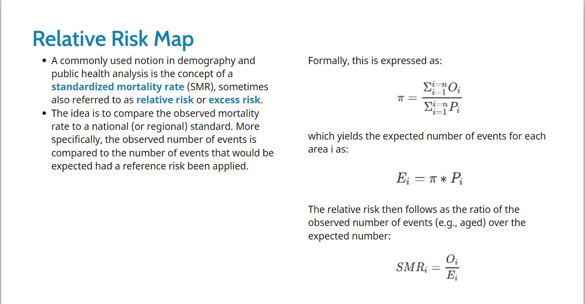

```{r setup, include=FALSE}
knitr::opts_chunk$set(echo = TRUE)
```

# Summary
  * install packages
  * import data: read_rds()
  * Plot choropleth maps
  * Boxplot: to see extreme values
  * Percentile map: to see extreme values, add spacial features to box-plot
    + before plot drop NA
    + get.var function
    + percentile map function
    + test function
  * Box map
    + drop NA
    + boxbreaks function
    + get.var function
    + box map function
    + test function
  * Choropleth Map for Rates
    + compute the raw rate
    + use boxmap function to plot the raw rate map
  * Relative risk map
  
# 1. Install packages

```{r}
packages = c('sf','tidyverse','tmap')
for(p in packages){
  if(!require(p,character.only = T)){
    install.packages(p)
  }
  library(p, character.only =  T)
}
```

# 2. Import data

```{r}
mpszpop2020 <- read_rds("data/mpszpop2020.rds")
```

# 3. Plot choropleth maps

```{r}
tm_shape(mpszpop2020)+
  tm_fill("AGED",
          n = 6,
          style = "quantile",
          palette = "Blues") +
  tm_borders(alpha = 0.5)
```
```{r}
tm_shape(mpszpop2020)+
  tm_fill("AGED",
          n = 6,
          style = "equal",
          palette = "Blues") +
  tm_borders(alpha = 0.5)
```

# 4. Boxplot: to see extreme values

```{r}
ggplot(data=mpszpop2020, 
       aes(x = "", 
           y = AGED)) +
  geom_boxplot()
```

# 5. Percentile map: to see extreme values, add spacial features to box-plot

## before plot drop NA
```{r}
mpszpop2020a <- mpszpop2020 %>%
  drop_na()
```

## hard coding get var
```{r}
percent <- c(0,.01,.1,.5,.9,.99,1)
var <- mpszpop2020a["DEPENDENCY"] %>%
  st_set_geometry(NULL) #must do this to calculate quantile
quantile(var[,1], percent)
```

## create the get.var function
```{r}
get.var <- function(vname,df) {
  v <- df[vname] %>% 
    st_set_geometry(NULL)
  v <- unname(v[,1])
  return(v)
}
```

## hardcoding percentile map using get.var function
```{r}
percent <- c(0,.01,.1,.5,.9,.99,1)
var <- get.var("DEPENDENCY", mpszpop2020a)
bperc <- quantile(var,percent)
tm_shape(mpszpop2020) + #do this to ensure the background
  tm_polygons() +
tm_shape(mpszpop2020a) +
  tm_fill("DEPENDENCY",
          title="DEPENDENCY",
          breaks=bperc,
          palette="Blues",
          labels=c("< 1%", "1% - 10%",
                   "10% - 50%", 
                   "50% - 90%",
                   "90% - 99%", 
                   "> 99%"))  +
  tm_borders() +
  tm_layout(title = "Percentile Map", 
            title.position = c("right",
                               "bottom"))
```

## create a percentile mapping function
```{r}
percentmap <- function(vnam, df, legtitle=NA, mtitle="Percentile Map"){
  percent <- c(0,.01,.1,.5,.9,.99,1)
  var <- get.var(vnam,df)
  bperc <- quantile(var,percent)
  tm_shape(mpszpop2020) +
  tm_polygons() +
  tm_shape(df) +
     tm_fill(vnam,
             title=legtitle,
             breaks=bperc,
             palette="Blues",
          labels=c("< 1%", "1% - 10%", "10% - 50%", "50% - 90%", "90% - 99%", "> 99%"))  +
  tm_borders() +
  tm_layout(title = mtitle, title.position = c("right","bottom"))
}
```

## Test drive the percentile mapping function
```{r}
youngmap <- percentmap("YOUNG", mpszpop2020a)
agedmap <- percentmap("AGED", mpszpop2020a)
```

# 6. Box map

## drop NA
```{r}
mpszpop2020a <- mpszpop2020 %>%
  filter(AGED>=0)
```

## create boxbreaks function
```{r}
boxbreaks <- function(v,mult=1.5) {
  qv <- unname(quantile(v))
  iqr <- qv[4] - qv[2]
  upfence <- qv[4] + mult * iqr
  lofence <- qv[2] - mult * iqr
  # initialize break points vector
  bb <- vector(mode="numeric",length=7)
  # logic for lower and upper fences
  if (lofence < qv[1]) {  # no lower outliers
    bb[1] <- lofence
    bb[2] <- floor(qv[1])
  } else {
    bb[2] <- lofence
    bb[1] <- qv[1]
  }
  if (upfence > qv[5]) { # no upper outliers
    bb[7] <- upfence
    bb[6] <- ceiling(qv[5])
  } else {
    bb[6] <- upfence
    bb[7] <- qv[5]
  }
  bb[3:5] <- qv[2:4]
  return(bb)
}
```

## Create the get.var function
```{r}
get.var <- function(vname,df) {
  v <- df[vname] %>% st_set_geometry(NULL)
  v <- unname(v[,1])
  return(v)
}
```

## Test drive the newly created function
```{r}
var <- get.var("AGED", mpszpop2020a) 
boxbreaks(var)
```

## box map function
```{r}
boxmap <- function(vnam, df, 
                   legtitle=NA,
                   mtitle="Box Map",
                   mult=1.5){
  var <- get.var(vnam,df)
  bb <- boxbreaks(var)
  tm_shape(mpszpop2020) +
  tm_polygons() +
  tm_shape(df) +
     tm_fill(vnam,title=legtitle,
             breaks=bb,
             palette="Blues",
          labels = c("lower outlier", 
                     "< 25%", 
                     "25% - 50%", 
                     "50% - 75%",
                     "> 75%", 
                     "upper outlier"))  +
  tm_borders() +
  tm_layout(title = mtitle, 
            title.position = c("right",
                               "bottom"))
}
```

## Test function: the box map of AGED population
```{r}
boxmap("ECONOMY ACTIVE", mpszpop2020a)
```

* The box map reveals that there are six upper outliers (i.e. planning subzone with extremely high numbers of aged population)
* Four of the upper outliers are located at the eastern region and they are closed to each others.
* There is no lower outlier.

# 7. Choropleth Map for Rates

## a. compute the raw rate
```{r}
mpszpop2020a <- mpszpop2020 %>%
  mutate(`AGED%` = (`AGED`
/`TOTAL`)*100) %>%
  filter(`AGED%` >= 0)
```

## b. use boxmap function to plot the raw rate map
```{r}
var <- get.var("AGED%", mpszpop2020a)
boxbreaks(var)
boxmap("AGED%",mpszpop2020a)
```

# 8. Relative risk map


