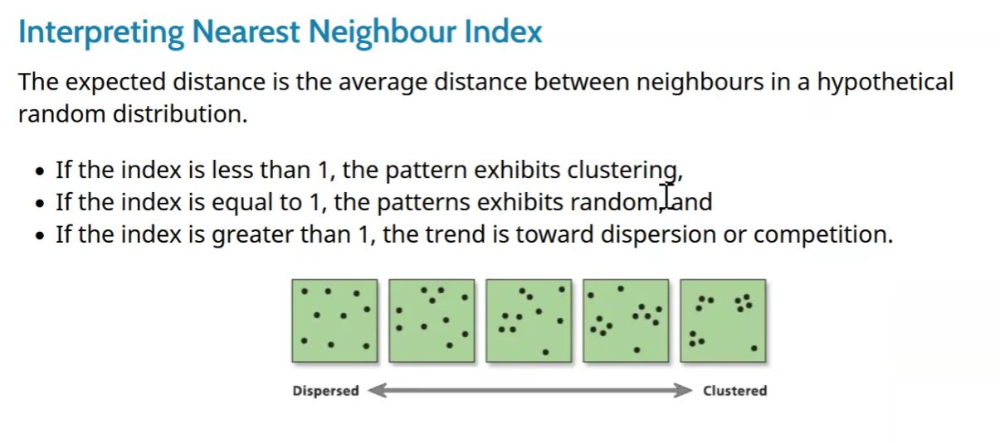
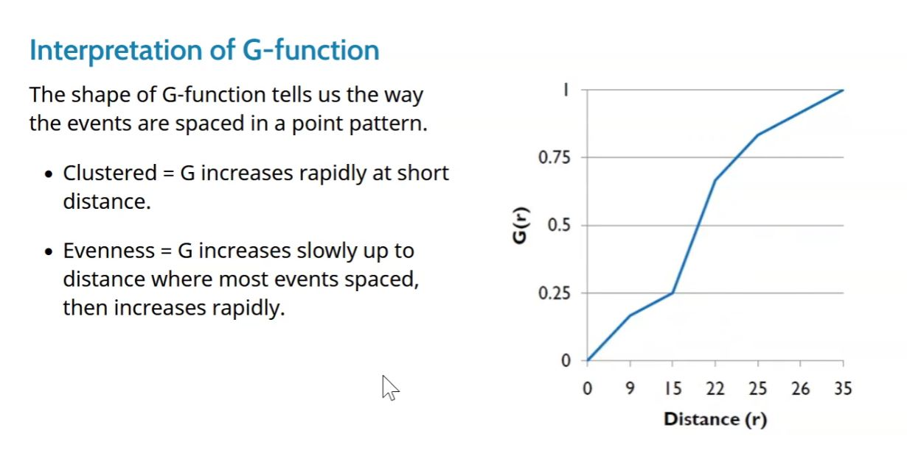

```{r setup, include=FALSE}
knitr::opts_chunk$set(echo = TRUE)
```

# 1. Install packages

```{r}
packages = c('maptools', 'sf', 'raster','spatstat', 'tmap')
for (p in packages){
if(!require(p, character.only = T)){
install.packages(p)
}
library(p,character.only = T)
}
```

# 2. Import and transform data

```{r}
childcare_sf <- st_read("data/child-care-services-geojson.geojson") %>%
  st_transform(crs = 3414)

sg_sf <- st_read(dsn = "data", layer="CostalOutline")

mpsz_sf <- st_read(dsn = "data", 
                layer = "MP14_SUBZONE_WEB_PL")
```
```{r}
sg_sf <- st_set_crs(sg_sf, 3414)
mpsz_sf <- st_set_crs(mpsz_sf, 3414)
st_crs(childcare_sf)
st_crs(sg_sf)
st_crs(mpsz_sf)
```

```{r}
#have a glance of the map
tm_shape(mpsz_sf) +
  tm_polygons() +
tm_shape(childcare_sf) +
  tm_dots() 


#tmap_mode('view')
#tm_shape(childcare_sf)+
#  tm_dots()
```

# 3. Geospatial data wrangling

## a. Converting sf data frames to Spatial class
```{r}
childcare <- as_Spatial(childcare_sf)
mpsz <- as_Spatial(mpsz_sf)
sg <- as_Spatial(st_zm(sg_sf))

summary(childcare)
summary(mpsz)
summary(sg)
```

## b. Converting the Spatial class into generic sp object
```{r}
childcare_sp <- as(childcare, "SpatialPoints")
sg_sp <- as(sg, "SpatialPolygons")
```

* generic sp object just preserves the shape of Spatial classes and drops the attribute table

## c. Converting the generic sp object into spatstat’s ppp object

* spatstat requires the analytical data in ppp object form, ppp object is more concise than sp's Spatial object

```{r}
#just convert SpatialPoints data, the target of analysis
childcare_ppp <- as(childcare_sp, "ppp")
childcare_ppp
plot(childcare_ppp)
summary(childcare_ppp)
```

## d. Handling duplicated points

* summary(childcare_ppp) warn about duplicates

```{r}
any(duplicated(childcare_ppp)) #check duplicates
multiplicity(childcare_ppp) #count duplicated points
sum(multiplicity(childcare_ppp) > 1) #count no. of locations with duplicated points

#view duplicated points
#tmap_mode('view')
#tm_shape(childcare) +
#  tm_dots(alpha=0.4, 
#          size=0.05)
```

#### to handle duplicate: jittering, which will add a small perturbation to the duplicate points so that they do not occupy the exact same space.
```{r}
childcare_ppp_jit <- rjitter(childcare_ppp, 
                             retry=TRUE, 
                             nsim=1, 
                             drop=TRUE)

any(duplicated(childcare_ppp_jit)) #recheck duplicates
```

## e. Creating owin object

* When analysing spatial point patterns, it is a good practice to confine the analysis with a geographical area like Singapore boundary. In spatstat, an object called owin is specially designed to represent this polygonal region.

#### covert sg SpatialPolygon object into owin object of spatstat.
```{r}
sg_owin <- as(sg_sp, "owin")
plot(sg_owin)
summary(sg_owin)
```

## f. Combining point events object and owin object
```{r}
childcareSG_ppp = childcare_ppp[sg_owin]
summary(childcareSG_ppp)
plot(childcareSG_ppp)
```

* The output object combined both the point and polygon feature in one ppp object class

# 4. First-order Spatial Point Patterns Analysis: A. deriving kernel density estimation (KDE) layer for visualising and exploring the intensity of point processes

* to do KDE must ensure the data are in projected coordinate system(in km or m), not geographic coordinate system(decimal degree)

## a. Computing kernel density estimation using automatic bandwidth selection method
```{r}
kde_childcareSG_bw <- density(childcareSG_ppp,
                              sigma=bw.diggle,
                              edge=TRUE,
                            kernel="gaussian") 

plot(kde_childcareSG_bw)
```

* The density values of the output range from 0 to 0.000035 which is way too small to comprehend. This is because the default unit of measurement of svy21 is in meter. As a result, the density values computed is in “number of points per square meter”.

#### Note: one can retrieve the bandwidth used to compute the kde layer by using the code chunk below.
```{r}
bw <- bw.diggle(childcareSG_ppp)
bw
```

## b. Rescale KDE values
```{r}
#covert the unit of measurement from meter to kilometer.
childcareSG_ppp.km <- rescale(childcareSG_ppp, 1000, "km")

#replot the map
kde_childcareSG.bw <- density(childcareSG_ppp.km, sigma=bw.diggle, edge=TRUE, kernel="gaussian")
plot(kde_childcareSG.bw)
```

## Working with different automatic badwidth methods

* Beside bw.diggle(), the automatic bandwidth selection method, there are three other spatstat functions can be used to determine the bandwidth, they are: bw.CvL(), bw.scott(), and bw.ppl().

```{r}
#take a look at the bandwidth return by these automatic bandwidth calculation methods
bw.CvL(childcareSG_ppp.km)
bw.scott(childcareSG_ppp.km)
bw.ppl(childcareSG_ppp.km)
bw.diggle(childcareSG_ppp.km)
```

* use bw.ppl() when the pattern consists predominantly of tight clusters. use bw.diggle() when purpose of once study is to detect a single tight cluster in the midst of random noise

#### compare the output of bw.diggle and bw.ppl.
```{r}
kde_childcareSG.ppl <- density(childcareSG_ppp.km, 
                               sigma=bw.ppl, 
                               edge=TRUE,
                               kernel="gaussian")
par(mfrow=c(1,2))
plot(kde_childcareSG.bw, main = "bw.diggle")
plot(kde_childcareSG.ppl, main = "bw.ppl")
```

## Working with different kernel methods

* By default, the kernel method used in density.ppp() is gaussian. But there are three other options, namely: Epanechnikov, Quartic and Dics.

```{r}
# compute three more kernel density estimations by using these three kernel function.
par(mfrow=c(2,2))
plot(density(childcareSG_ppp.km, 
             sigma=bw.ppl, 
             edge=TRUE, 
             kernel="gaussian"), 
     main="Gaussian")
plot(density(childcareSG_ppp.km, 
             sigma=bw.ppl, 
             edge=TRUE, 
             kernel="epanechnikov"), 
     main="Epanechnikov")
plot(density(childcareSG_ppp.km, 
             sigma=bw.ppl, 
             edge=TRUE, 
             kernel="quartic"), 
     main="Quartic")
plot(density(childcareSG_ppp.km, 
             sigma=bw.ppl, 
             edge=TRUE, 
             kernel="disc"), 
     main="Disc")
```

## Fixed and Adaptive KDE
#### Compute KDE by using fixed bandwidth
```{r}
#compute a KDE layer by defining a bandwidth of 600 meter. Notice the sigma value used is 0.6. This is because the unit of measurement of childcareSG_ppp.km object is in kilometer, hence the 600m is 0.6km.

kde_childcareSG_600 <- density(childcareSG_ppp.km, sigma=0.6, edge=TRUE, kernel="gaussian")
plot(kde_childcareSG_600)
```

#### Compute KDE by using adaptive bandwidth

* Fixed bandwidth method is very sensitive to highly skew distribution of spatial point patterns over geographical units for example urban versus rural. One way to overcome this problem is by using adaptive bandwidth instead.

```{r}
kde_childcareSG_adaptive <- adaptive.density(childcareSG_ppp.km, method="kernel")
plot(kde_childcareSG_adaptive)
```

#### compare the fixed and adaptive kernel density estimation
```{r}
par(mfrow=c(1,2))
plot(kde_childcareSG.bw, main = "Fixed bandwidth")
plot(kde_childcareSG_adaptive, main = "Adaptive bandwidth")
```

## Convert KDE output into raster
#### Convert KDE output into grid
```{r}
gridded_kde_childcareSG_bw <- as.SpatialGridDataFrame.im(kde_childcareSG.bw)
spplot(gridded_kde_childcareSG_bw)
```

#### Convert gridded output into raster
```{r}
kde_childcareSG_bw_raster <- raster(gridded_kde_childcareSG_bw)

kde_childcareSG_bw_raster #look at its property, notice that the crs property is NA.
```

#### Assign projection system to raster
```{r}
projection(kde_childcareSG_bw_raster) <- CRS("+init=EPSG:3414")
kde_childcareSG_bw_raster ##Notice that the crs property is completed.
```

#### Visualise the raster output in tmap
```{r}
tm_shape(kde_childcareSG_bw_raster) + 
  tm_raster("v") +
  tm_layout(legend.position = c("right", "bottom"), frame = FALSE)
```

* Notice that the raster values are encoded explicitly onto the raster pixel using the values in “v”" field.

## Compare Spatial Point Patterns using KDE (Analysis Example)

* In this section, you will learn how to compare KDE of childcare at Ponggol, Tampines, Chua Chu Kang and Jurong West planning areas.

#### Extract study areas
```{r}
pg = mpsz[mpsz@data$PLN_AREA_N == "PUNGGOL",]
tm = mpsz[mpsz@data$PLN_AREA_N == "TAMPINES",]
ck = mpsz[mpsz@data$PLN_AREA_N == "CHOA CHU KANG",]
jw = mpsz[mpsz@data$PLN_AREA_N == "JURONG WEST",]
```

#### Plot target planning areas
```{r}
par(mfrow=c(2,2))
plot(pg, main = "Ponggol")
plot(tm, main = "Tampines")
plot(ck, main = "Choa Chu Kang")
plot(jw, main = "Jurong West")
```

#### Convert the Spatial polygons data frame into generic spatialpolygons format
```{r}
pg_sp = as(pg, "SpatialPolygons")
tm_sp = as(tm, "SpatialPolygons")
ck_sp = as(ck, "SpatialPolygons")
jw_sp = as(jw, "SpatialPolygons")
```

#### convert these SpatialPolygons objects into owin objects that is required by spatstat
```{r}
pg_owin = as(pg_sp, "owin")
tm_owin = as(tm_sp, "owin")
ck_owin = as(ck_sp, "owin")
jw_owin = as(jw_sp, "owin")
```

#### Combine childcare points and the study areas
```{r}
childcare_pg_ppp = childcare_ppp_jit[pg_owin]
childcare_tm_ppp = childcare_ppp_jit[tm_owin]
childcare_ck_ppp = childcare_ppp_jit[ck_owin]
childcare_jw_ppp = childcare_ppp_jit[jw_owin]
```

#### transform the unit of measurement from metre to kilometre
```{r}
childcare_pg_ppp.km = rescale(childcare_pg_ppp, 1000, "km")
childcare_tm_ppp.km = rescale(childcare_tm_ppp, 1000, "km")
childcare_ck_ppp.km = rescale(childcare_ck_ppp, 1000, "km")
childcare_jw_ppp.km = rescale(childcare_jw_ppp, 1000, "km")
```

#### plot these four study areas and the locations of the childcare centres
```{r}
par(mfrow=c(2,2))
plot(childcare_pg_ppp.km, main="Punggol")
plot(childcare_tm_ppp.km, main="Tampines")
plot(childcare_ck_ppp.km, main="Choa Chu Kang")
plot(childcare_jw_ppp.km, main="Jurong West")
```

#### compute KDE
```{r}
# bw.diggle method is used
par(mfrow=c(2,2))
plot(density(childcare_pg_ppp.km, 
             sigma=bw.diggle, 
             edge=TRUE, 
             kernel="gaussian"),
     main="Punggol")
plot(density(childcare_tm_ppp.km, 
             sigma=bw.diggle, 
             edge=TRUE, 
             kernel="gaussian"),
     main="Tempines")
plot(density(childcare_ck_ppp.km, 
             sigma=bw.diggle, 
             edge=TRUE, 
             kernel="gaussian"),
     main="Choa Chu Kang")
plot(density(childcare_jw_ppp.km, 
             sigma=bw.diggle, 
             edge=TRUE, 
             kernel="gaussian"),
     main="JUrong West")
```

#### compute fixed bandwidth KDE
```{r}
# For comparison purposes, we will use 250m as the bandwidth.
par(mfrow=c(2,2))
plot(density(childcare_ck_ppp.km, 
             sigma=0.25, 
             edge=TRUE, 
             kernel="gaussian"),
     main="Chou Chu Kang")
plot(density(childcare_jw_ppp.km, 
             sigma=0.25, 
             edge=TRUE, 
             kernel="gaussian"),
     main="JUrong West")
plot(density(childcare_pg_ppp.km, 
             sigma=0.25, 
             edge=TRUE, 
             kernel="gaussian"),
     main="Punggol")
plot(density(childcare_tm_ppp.km, 
             sigma=0.25, 
             edge=TRUE, 
             kernel="gaussian"),
     main="Tampines")
```

# 5. First-order Spatial Point Patterns Analysis: B. perform Confirmatory Spatial Point Patterns Analysis by using Nearest Neighbour statistics

* perform the Clark-Evans test of aggregation for a spatial point pattern
* The test hypotheses are:
  + H0 = The distribution of childcare services are randomly distributed.
  + H1= The distribution of childcare services are not randomly distributed.
  + The 95% confident interval will be used.
  
## Testing spatial point patterns using Clark and Evans Test
```{r}
clarkevans.test(childcareSG_ppp,
                correction="none",
                clipregion="sg_owin",
                alternative=c("clustered"),
                nsim=99)
```

#### Clark and Evans Test: Choa Chu Kang planning area
```{r}
clarkevans.test(childcare_ck_ppp,
                correction="none",
                clipregion=NULL,
                alternative=c("two.sided"),
                nsim=999)
```

#### Clark and Evans Test: Tampines planning area
```{r}
clarkevans.test(childcare_tm_ppp,
                correction="none",
                clipregion=NULL,
                alternative=c("two.sided"),
                nsim=999)
```

## if reject null-hypothesis, infer from R value


# 6. Second-order Spatial Point Patterns Analysis: A. Analysing Spatial Point Process Using G-Function

* The G function measures the distribution of the distances from an arbitrary event to its nearest event.




## Choa Chu Kang planning area G-Function estimation
```{r}
G_CK = Gest(childcare_ck_ppp, correction = "border")
plot(G_CK, xlim=c(0,500))
```

#### perform complete spatial randomness test

* To confirm the observed spatial patterns above, a hypothesis test will be conducted. The hypothesis and test are as follows:
  + Ho = The distribution of childcare services at Choa Chu Kang are randomly distributed.
  + H1= The distribution of childcare services at Choa Chu Kang are not randomly distributed.
  + The null hypothesis will be rejected if p-value is smaller than alpha value of 0.001.

#### Monte Carlo test with G-fucntion
```{r}
G_CK.csr <- envelope(childcare_ck_ppp, Gest, nsim = 999)
plot(G_CK.csr)
```

## Tampines planning area G-Function estimation
```{r}
G_tm = Gest(childcare_tm_ppp, correction = "best")
plot(G_tm)
```

#### perform complete spatial randomness test

* To confirm the observed spatial patterns above, a hypothesis test will be conducted. The hypothesis and test are as follows:
  + H0 = The distribution of childcare services at Tampines are randomly distributed.
  + H1= The distribution of childcare services at Tampines are not randomly distributed.
  + The null hypothesis will be rejected is p-value is smaller than alpha value of 0.001.

#### Monte Carlo test with G-fucntion
```{r}
G_tm.csr <- envelope(childcare_tm_ppp, Gest, correction = "all", nsim = 999)
plot(G_tm.csr)
```

# 7. Second-order Spatial Point Patterns Analysis: B. Analysing Spatial Point Process Using F-Function

* The F function estimates the empty space function F(r) or its hazard rate h(r) from a point pattern in a window of arbitrary shape.


## Choa Chu Kang planning area F-Function estimation
```{r}
F_CK = Fest(childcare_ck_ppp)
plot(F_CK)
```

#### perform complete spatial randomness test

* To confirm the observed spatial patterns above, a hypothesis test will be conducted. The hypothesis and test are as follows:
  + H0 = The distribution of childcare services at Choa Chu Kang are randomly distributed.
  + H1= The distribution of childcare services at Choa Chu Kang are not randomly distributed.
  + The null hypothesis will be rejected if p-value is smaller than alpha value of 0.001.
  
#### Monte Carlo test with F-fucntion
```{r}
F_CK.csr <- envelope(childcare_ck_ppp, Fest, nsim = 999)
plot(F_CK.csr)
```

## Tampines planning area F-Function estimation
```{r}
F_tm = Fest(childcare_tm_ppp, correction = "best")
plot(F_tm)
```

#### perform complete spatial randomness test

* To confirm the observed spatial patterns above, a hypothesis test will be conducted. The hypothesis and test are as follows:
  + H0 = The distribution of childcare services at Tampines are randomly distributed.
  + H1= The distribution of childcare services at Tampines are not randomly distributed.
  + The null hypothesis will be rejected if p-value is smaller than alpha value of 0.001.
  
#### Monte Carlo test with F-fucntion
```{r}
F_tm.csr <- envelope(childcare_tm_ppp, Fest, correction = "all", nsim = 999)
plot(F_tm.csr)
```

# 8. Second-order Spatial Point Patterns Analysis: C. Analysing Spatial Point Process Using K-Function

* K-function measures the number of events found up to a given distance of any particular event.


## Choa Chu Kang planning area K-Function estimation
```{r}
K_ck = Kest(childcare_ck_ppp, correction = "Ripley")
plot(K_ck, . -r ~ r, ylab= "K(d)-r", xlab = "d(m)")
```

#### perform complete spatial randomness test

* To confirm the observed spatial patterns above, a hypothesis test will be conducted. The hypothesis and test are as follows:
  + H0 = The distribution of childcare services at Choa Chu Kang are randomly distributed.
  + H1= The distribution of childcare services at Choa Chu Kang are not randomly distributed.
  + The null hypothesis will be rejected if p-value is smaller than alpha value of 0.001.
  
#### Monte Carlo test with K-fucntion
```{r}
K_ck.csr <- envelope(childcare_ck_ppp, Kest, nsim = 99, rank = 1, glocal=TRUE)
plot(K_ck.csr, . - r ~ r, xlab="d", ylab="K(d)-r")
```

## Tampines planning area K-Function estimation
```{r}
K_tm = Kest(childcare_tm_ppp, correction = "Ripley")
plot(K_tm, . -r ~ r, 
     ylab= "K(d)-r", xlab = "d(m)", 
     xlim=c(0,1000))
```

#### perform complete spatial randomness test

* To confirm the observed spatial patterns above, a hypothesis test will be conducted. The hypothesis and test are as follows:
  + H0 = The distribution of childcare services at Tampines are randomly distributed.
  + H1= The distribution of childcare services at Tampines are not randomly distributed.
  + The null hypothesis will be rejected if p-value is smaller than alpha value of 0.001.
  
#### Monte Carlo test with K-fucntion
```{r}
K_tm.csr <- envelope(childcare_tm_ppp, Kest, nsim = 99, rank = 1, glocal=TRUE)
plot(K_tm.csr, . - r ~ r, 
     xlab="d", ylab="K(d)-r", xlim=c(0,500))
```

# 9. Second-order Spatial Point Patterns Analysis: D. Analysing Spatial Point Process Using L-Function


## Choa Chu Kang planning area L-Function estimation
```{r}
L_ck = Lest(childcare_ck_ppp, correction = "Ripley")
plot(L_ck, . -r ~ r, 
     ylab= "L(d)-r", xlab = "d(m)")
```

#### perform complete spatial randomness test

* To confirm the observed spatial patterns above, a hypothesis test will be conducted. The hypothesis and test are as follows:
  + H0 = The distribution of childcare services at Choa Chu Kang are randomly distributed.
  + H1= The distribution of childcare services at Choa Chu Kang are not randomly distributed.
  + The null hypothesis will be rejected if p-value is smaller than alpha value of 0.001.
  
#### Monte Carlo test with L-fucntion
```{r}
L_ck.csr <- envelope(childcare_ck_ppp, Lest, nsim = 99, rank = 1, glocal=TRUE)
plot(L_ck.csr, . - r ~ r, xlab="d", ylab="L(d)-r")
```

## Tampines planning area L-Function estimation
```{r}
L_tm = Lest(childcare_tm_ppp, correction = "Ripley")
plot(L_tm, . -r ~ r, 
     ylab= "L(d)-r", xlab = "d(m)", 
     xlim=c(0,1000))
```

#### perform complete spatial randomness test

* To confirm the observed spatial patterns above, a hypothesis test will be conducted. The hypothesis and test are as follows:
  + H0 = The distribution of childcare services at Tampines are randomly distributed.
  + H1= The distribution of childcare services at Tampines are not randomly distributed.
  + The null hypothesis will be rejected if p-value is smaller than alpha value of 0.001.
  
#### Monte Carlo test with L-fucntion
```{r}
L_tm.csr <- envelope(childcare_tm_ppp, Lest, nsim = 99, rank = 1, glocal=TRUE)
plot(L_tm.csr, . - r ~ r, 
     xlab="d", ylab="L(d)-r", xlim=c(0,500))
```


