```{r setup, include=FALSE}
knitr::opts_chunk$set(echo = TRUE)
options(width=200)
```

# Take-home Exercise 2 requirements
* Section A: Airbnb Distribution in 2019
  + In this section, you are tasked to investigate if the distribution of Airbnb listings are affected by location factors such as near to existing hotels, MRT services and tourist attractions. For the purpose of this analysis, Airbnb listings as at June 2019 should be used.
* Section B: Impact of COVID-19
  + In this section, you are required to analyse the impact of COVID-19 on Airbnb business in Singapore by comparing Airbnb listings data on June 2019 and June 2021.

# Things learned from Take-home Exercise 1
* For the interactive map, keep the legend out of the map view
* Describe the purpose of each step
* Explain packages used

# Note!
* For some code chunks, it takes a lot of time to load the outputs, in order for everything to run/knit/push smoothly, I have made some of them eval=FALSE and insert images of their outputs in this webpage.

# Data used
* SG Airbnb listings for June 2019 and June 2021 from [Inside Airbnb](http://insideairbnb.com/get-the-data.html)
* Hotels, tourist attractions from SLA OneMap Service by using [onemapsgapi](https://cran.r-project.org/web/packages/onemapsgapi/index.html)
* SG MRT stations and SG bus stops shapefiles from [LTA DataMall](https://datamall.lta.gov.sg/content/datamall/en/search_datasets.html)
* SG Hawker Centres in GEOJASON format from [data.gov.sg](https://data.gov.sg/dataset/hawker-centres?resource_id=8a6c2f75-5511-4e03-b8f2-23ce67d30b28)
* CostalOutline, a polygon feature data showing the national boundary of Singapore. It is provided by SLA and is in ESRI shapefile format.

# 1. Install packages

```{r}
packages = c('maptools', 'sf', 'raster','spatstat', 'tmap','tidyverse')
for (p in packages){
if(!require(p, character.only = T)){
install.packages(p)
}
library(p,character.only = T)
}
```

* six R packages will be used for the following purposes:
  + sf, a relatively new R package specially designed to import, manage and process vector-based geospatial data in R.
  + spatstat, which has a wide range of useful functions for point pattern analysis. In this hands-on exercise, it will be used to perform 1st- and 2nd-order spatial point patterns analysis and derive kernel density estimation (KDE) layer.
  + raster which reads, writes, manipulates, analyses and model of gridded spatial data (i.e. raster). In this hands-on exercise, it will be used to convert image output generate by spatstat into raster format.
  + tidyverse for performing data science tasks such as importing, wrangling and visualising data.
  + maptools which provides a set of tools for manipulating geographic data. In this hands-on exercise, we mainly use it to convert Spatial objects into ppp format of spatstat.
  + tmap which provides functions for plotting cartographic quality static point patterns maps or interactive maps by using leaflet API.

# 2. Import and transform data

```{r}
MRT_sf <- st_read(dsn = "data/LTA_TrainStation_Aug2021", layer="MRTLRTStnPtt")
sg_sf <- st_read(dsn = "data/sg", layer="CostalOutline")
bus_sf <- st_read(dsn = "data/BusStopLocation", layer="BusStop")

listings21 <- read_csv("data/Airbnb_listings/29062021.csv")
listings19 <- read_csv("data/Airbnb_listings/30062019.csv")

hotels <- read_csv("data/OneMap_Data/hotels.csv")
tourism <- read_csv("data/OneMap_Data/tourism.csv")
hawker_sf <- st_read("data/hawker_centres/hawker-centres-geojson.geojson") %>%
  st_transform(crs = 3414)
```

```{r}
listings21_sf <- st_as_sf(listings21, 
                       coords = c("longitude", "latitude"),
                       crs=4326) %>%
  st_transform(crs = 3414)

listings19_sf <- st_as_sf(listings19, 
                       coords = c("longitude", "latitude"),
                       crs=4326) %>%
  st_transform(crs = 3414)

hotels_sf <- st_as_sf(hotels, 
                       coords = c("Lng", "Lat"),
                       crs=4326) %>%
  st_transform(crs = 3414)

tourism_sf <- st_as_sf(tourism, 
                       coords = c("Lng", "Lat"),
                       crs=4326) %>%
  st_transform(crs = 3414)

MRT_sf <- st_set_crs(MRT_sf, 3414)
sg_sf <- st_set_crs(sg_sf, 3414)
bus_sf <- st_set_crs(bus_sf, 3414)
```

## Have a glance at the point maps
```{r}
tmap_mode("view")
tmap_options(check.and.fix = TRUE)

tm_shape(sg_sf) +
  tm_polygons() +
tm_shape(listings19_sf) +
  tm_dots(alpha=0.4,
          col="blue",
          size=0.05) +
tm_shape(listings21_sf) +
  tm_dots(alpha=0.4,
          col="red",
          size=0.05)

tmap_mode("plot")
```

# 3. Geospatial data wrangling

## a. Converting sf data frames to Spatial class
```{r}
MRT <- as_Spatial(MRT_sf)
listings21 <- as_Spatial(listings21_sf)
listings19 <- as_Spatial(listings19_sf)
hotels <- as_Spatial(hotels_sf)
tourism <- as_Spatial(tourism_sf)
sg <- as_Spatial(st_zm(sg_sf))
hawker <- as_Spatial(hawker_sf)
bus <- as_Spatial(bus_sf)
```

## b. Converting the Spatial class into generic sp object
```{r}
MRT_sp <- as(MRT, "SpatialPoints")
listings21_sp <- as(listings21, "SpatialPoints")
listings19_sp <- as(listings19, "SpatialPoints")
hotels_sp <- as(hotels, "SpatialPoints")
tourism_sp <- as(tourism, "SpatialPoints")
sg_sp <- as(sg, "SpatialPolygons")
hawker_sp <- as(hawker, "SpatialPoints")
bus_sp <- as(bus, "SpatialPoints")
```

## c. Converting the generic sp object into spatstat’s ppp object

* spatstat requires the analytical data in ppp object form

```{r}
MRT_ppp <- as(MRT_sp, "ppp")
listings21_ppp <- as(listings21_sp, "ppp")
listings19_ppp <- as(listings19_sp, "ppp")
hotels_ppp <- as(hotels_sp, "ppp")
tourism_ppp <- as(tourism_sp, "ppp")
hawker_ppp <- as(hawker_sp, "ppp")
bus_ppp <- as(bus_sp, "ppp")
```

```{r}
summary(MRT_ppp)
summary(listings21_ppp)
summary(listings19_ppp)
summary(hotels_ppp)
summary(tourism_ppp)
summary(hawker_ppp)
summary(bus_ppp)
```

* listings21_ppp, listings19_ppp, hotels_ppp and tourism_ppp contian duplicate points

## d. Handling duplicate points

* To handle duplicate: jittering, which will add a small perturbation to the duplicate points so that they do not occupy the exact same space.

```{r}
listings21_ppp_jit <- rjitter(listings21_ppp, 
                             retry=TRUE, 
                             nsim=1, 
                             drop=TRUE)

any(duplicated(listings21_ppp_jit))

listings19_ppp_jit <- rjitter(listings19_ppp, 
                             retry=TRUE, 
                             nsim=1, 
                             drop=TRUE)

any(duplicated(listings19_ppp_jit))

hotels_ppp_jit <- rjitter(hotels_ppp, 
                             retry=TRUE, 
                             nsim=1, 
                             drop=TRUE)

any(duplicated(hotels_ppp_jit))

tourism_ppp_jit <- rjitter(tourism_ppp, 
                             retry=TRUE, 
                             nsim=1, 
                             drop=TRUE)

any(duplicated(tourism_ppp_jit))

any(duplicated(MRT_ppp))
any(duplicated(hawker_ppp))
any(duplicated(bus_ppp))
```

## e. Creating owin object

* When analysing spatial point patterns, it is a good practice to confine the analysis with a geographical area like Singapore boundary. In spatstat, an object called owin is specially designed to represent this polygonal region.

#### covert sg spatialpolygon object into owin object of spatstat
```{r}
sg_owin <- as(sg_sp, "owin")
plot(sg_owin)
```

## f. Combining point events object and owin object
```{r}
listings21SG_ppp = listings21_ppp_jit[sg_owin]
listings19SG_ppp = listings19_ppp_jit[sg_owin]
hotelsSG_ppp = hotels_ppp_jit[sg_owin]
tourismSG_ppp = tourism_ppp_jit[sg_owin]
MRTSG_ppp = MRT_ppp[sg_owin]
hawkerSG_ppp = hawker_ppp[sg_owin]
busSG_ppp = bus_ppp[sg_owin]
```

```{r fig.width=20, fig.height=30}
par(mar=c(1,1,1,1))
par(mfrow=c(4,2))
plot(listings21SG_ppp)
plot(listings19SG_ppp)
plot(hotelsSG_ppp)
plot(tourismSG_ppp)
plot(MRTSG_ppp)
plot(hawkerSG_ppp)
plot(busSG_ppp)
```

# 4. Section A: Airbnb Distribution in 2019
# 4.1 First-order Spatial Point Patterns Analysis: A. deriving kernel density estimation (KDE) layer for visualising and exploring the intensity of point processes

## a. Computing kernel density estimation using automatic bandwidth selection method
#### Using sigma = bw.diggle
```{r, warning = FALSE}
# Rescale KDE values: covert the unit of measurement from meter to kilometer.
listings19SG_ppp.km <- rescale(listings19SG_ppp, 1000, "km")
#plot
kde_listings19SG_bw <- density(listings19SG_ppp.km,
                              sigma=bw.diggle,
                              edge=TRUE,
                            kernel="gaussian") 

# Rescale KDE values: covert the unit of measurement from meter to kilometer.
hotelsSG_ppp.km <- rescale(hotelsSG_ppp, 1000, "km")
#plot
kde_hotelsSG_bw <- density(hotelsSG_ppp.km,
                              sigma=bw.diggle,
                              edge=TRUE,
                            kernel="gaussian") 

# Rescale KDE values: covert the unit of measurement from meter to kilometer.
tourismSG_ppp.km <- rescale(tourismSG_ppp, 1000, "km")
#plot
kde_tourismSG_bw <- density(tourismSG_ppp.km,
                              sigma=bw.diggle,
                              edge=TRUE,
                            kernel="gaussian") 

# Rescale KDE values: covert the unit of measurement from meter to kilometer.
MRTSG_ppp.km <- rescale(MRTSG_ppp, 1000, "km")
#plot
kde_MRTSG_bw <- density(MRTSG_ppp.km,
                              sigma=bw.diggle,
                              edge=TRUE,
                            kernel="gaussian")

# Rescale KDE values: covert the unit of measurement from meter to kilometer.
hawkerSG_ppp.km <- rescale(hawkerSG_ppp, 1000, "km")
#plot
kde_hawkerSG_bw <- density(hawkerSG_ppp.km,
                              sigma=bw.diggle,
                              edge=TRUE,
                            kernel="gaussian")

# Rescale KDE values: covert the unit of measurement from meter to kilometer.
busSG_ppp.km <- rescale(busSG_ppp, 1000, "km")
#plot
kde_busSG_bw <- density(busSG_ppp.km,
                              sigma=bw.diggle,
                              edge=TRUE,
                            kernel="gaussian")

par(mar=c(1,1,1,1))
par(mfrow=c(3,2))
plot(kde_listings19SG_bw, main = "listings19")
plot(kde_hotelsSG_bw, main = "hotels")
plot(kde_tourismSG_bw, main = "tourism")
plot(kde_MRTSG_bw, main = "MRT")
plot(kde_hawkerSG_bw, main = "hawker")
plot(kde_busSG_bw, main = "bus")
```

#### RETRIEVE THE BANDWIDTH USED TO COMPUTE THE KDE LAYER
```{r, warning=FALSE, eval=FALSE}
cat('bandwidth for listings19: ', bw.diggle(listings19SG_ppp.km), '\n')
cat('bandwidth for hotels: ', bw.diggle(hotelsSG_ppp.km), '\n')
cat('bandwidth for tourism: ', bw.diggle(tourismSG_ppp.km), '\n')
cat('bandwidth for MRT: ', bw.diggle(MRTSG_ppp.km), '\n')
cat('bandwidth for hawker: ', bw.diggle(hawkerSG_ppp.km), '\n')
cat('bandwidth for bus: ', bw.diggle(busSG_ppp.km), '\n')
```

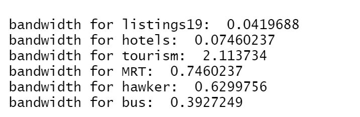

* Besides bw.diggle(), we can also use bw.ppl() automatic bandwidth selection method, let's try to use it

#### Let's try to look at the bandwidths returned by these two methods first
```{r, warning = FALSE}
#let's see some examples
bw.diggle(listings19SG_ppp.km)
bw.ppl(listings19SG_ppp.km)

bw.diggle(tourismSG_ppp.km)
bw.ppl(tourismSG_ppp.km)

bw.diggle(busSG_ppp.km)
bw.ppl(busSG_ppp.km)
```

* We can see for listings19SG_ppp.km and tourismSG_ppp.km Diggle algorithm gives narrower bandwiths while for busSG_ppp.km it gives broader bandwiths.

#### Using sigma = bw.ppl
```{r, warning = FALSE}
kde_listings19SG_ppl <- density(listings19SG_ppp.km,
                              sigma=bw.ppl,
                              edge=TRUE,
                            kernel="gaussian") 

kde_hotelsSG_ppl <- density(hotelsSG_ppp.km,
                              sigma=bw.ppl,
                              edge=TRUE,
                            kernel="gaussian") 

kde_tourismSG_ppl <- density(tourismSG_ppp.km,
                              sigma=bw.ppl,
                              edge=TRUE,
                            kernel="gaussian") 

kde_MRTSG_ppl <- density(MRTSG_ppp.km,
                              sigma=bw.ppl,
                              edge=TRUE,
                            kernel="gaussian")

kde_hawkerSG_ppl <- density(hawkerSG_ppp.km,
                              sigma=bw.ppl,
                              edge=TRUE,
                            kernel="gaussian")

kde_busSG_ppl <- density(busSG_ppp.km,
                              sigma=bw.ppl,
                              edge=TRUE,
                            kernel="gaussian")
```

#### plot and compare bw.diggle and bw.ppl
```{r, warning = FALSE,  fig.width=20, fig.height=30}
par(mar=c(1,1,1,1))
par(mfrow=c(6,2))
plot(kde_listings19SG_bw, main = "listings19 diggle")
plot(kde_listings19SG_ppl, main = "listings19 ppl")
plot(kde_hotelsSG_bw, main = "hotels diggle")
plot(kde_hotelsSG_ppl, main = "hotels ppl")
plot(kde_tourismSG_bw, main = "tourism diggle")
plot(kde_tourismSG_ppl, main = "tourism ppl")
plot(kde_MRTSG_bw, main = "MRT diggle")
plot(kde_MRTSG_ppl, main = "MRT ppl")
plot(kde_hawkerSG_bw, main = "hawker diggle")
plot(kde_hawkerSG_ppl, main = "hawker ppl")
plot(kde_busSG_bw, main = "bus diggle")
plot(kde_busSG_ppl, main = "bus ppl")
```

* We can see that for graphs consist predominantly of tight clusters (all the graphs besides bus), bw.ppl produce the more appropriate values; for graphs that consist lots of spreading points (bus graph, clusters not tight and predominant), bw.diggle is good at detecting at/emphasizing on clusters among those points. This observation is in accord with Baddeley's (2016) observation. However, since the spreading points for SG bus stops are all legit and not random noise, it's better to use bw.diggle for this study.

## b. Computing kernel density estimation using fixed/adaptive bandwidth method
#### using fixed bandwidth
```{r, warning = FALSE}
#compute a KDE layer by defining a bandwidth of 1000 meter. Notice the sigma value used is 1. This is because the unit of measurement of childcareSG_ppp.km object is in kilometer, hence the 1000m is 1km.

kde_listings19SG_bw_1 <- density(listings19SG_ppp.km,
                              sigma=1,
                              edge=TRUE,
                            kernel="gaussian") 

kde_hotelsSG_bw_1 <- density(hotelsSG_ppp.km,
                              sigma=1,
                              edge=TRUE,
                            kernel="gaussian") 

kde_tourismSG_bw_1 <- density(tourismSG_ppp.km,
                              sigma=1,
                              edge=TRUE,
                            kernel="gaussian") 

kde_MRTSG_bw_1 <- density(MRTSG_ppp.km,
                              sigma=1,
                              edge=TRUE,
                            kernel="gaussian")

kde_hawkerSG_bw_1 <- density(hawkerSG_ppp.km,
                              sigma=1,
                              edge=TRUE,
                            kernel="gaussian")

kde_busSG_bw_1 <- density(busSG_ppp.km,
                              sigma=1,
                              edge=TRUE,
                            kernel="gaussian")
```

#### using adaptive bandwidth
```{r, warning = FALSE}
kde_listings19SG_adaptive <- adaptive.density(listings19SG_ppp.km, method="kernel")

kde_hotelsSG_adaptive <- adaptive.density(hotelsSG_ppp.km, method="kernel")

kde_tourismSG_adaptive <- adaptive.density(tourismSG_ppp.km, method="kernel")

kde_MRTSG_adaptive <- adaptive.density(MRTSG_ppp.km, method="kernel")

kde_hawkerSG_adaptive <- adaptive.density(hawkerSG_ppp.km, method="kernel")

kde_busSG_adaptive <- adaptive.density(busSG_ppp.km, method="kernel")
```

#### plot and compare fixed and adaptive bandwidth
```{r, warning = FALSE,  fig.width=20, fig.height=30}
par(mar=c(1,1,1,1))
par(mfrow=c(6,2))
plot(kde_listings19SG_bw_1, main = "listings19 fixed")
plot(kde_listings19SG_adaptive, main = "listings19 adaptive")
plot(kde_hotelsSG_bw_1, main = "hotels fixed")
plot(kde_hotelsSG_adaptive, main = "hotels adaptive")
plot(kde_tourismSG_bw_1, main = "tourism fixed")
plot(kde_tourismSG_adaptive, main = "tourism adaptive")
plot(kde_MRTSG_bw_1, main = "MRT fixed")
plot(kde_MRTSG_adaptive, main = "MRT adaptive")
plot(kde_hawkerSG_bw_1, main = "hawker fixed")
plot(kde_hawkerSG_adaptive, main = "hawker adaptive")
plot(kde_busSG_bw_1, main = "bus fixed")
plot(kde_busSG_adaptive, main = "bus adaptive")
```

* From the graphs above we can see fixed bandwidth method is very sensitive to highly skew distribution of spatial point patterns over geographical units. However for adaptive bandwidth method, it is not that good to identify the important clusters, for example the tourism graph and the bus graph. Thus for this study, the best estimate for kernel density is by using auto bandwidth method bw.diggle.

## c. Convert KDE output into raster and display the kernel density maps on openstreetmap of Singapore
```{r, warning=FALSE}
# convert KDE output into grid
gridded_kde_listings19SG_bw <- as.SpatialGridDataFrame.im(kde_listings19SG_bw)
gridded_kde_hotelsSG_bw <- as.SpatialGridDataFrame.im(kde_hotelsSG_bw)
gridded_kde_tourismSG_bw <- as.SpatialGridDataFrame.im(kde_tourismSG_bw)
gridded_kde_MRTSG_bw <- as.SpatialGridDataFrame.im(kde_MRTSG_bw)
gridded_kde_hawkerSG_bw <- as.SpatialGridDataFrame.im(kde_hawkerSG_bw)
gridded_kde_busSG_bw <- as.SpatialGridDataFrame.im(kde_busSG_bw)

# convert gridded output into raster
kde_listings19SG_bw_raster <- raster(gridded_kde_listings19SG_bw)
kde_hotelsSG_bw_raster <- raster(gridded_kde_hotelsSG_bw)
kde_tourismSG_bw_raster <- raster(gridded_kde_tourismSG_bw)
kde_MRTSG_bw_raster <- raster(gridded_kde_MRTSG_bw)
kde_hawkerSG_bw_raster <- raster(gridded_kde_hawkerSG_bw)
kde_busSG_bw_raster <- raster(gridded_kde_busSG_bw)

# assign projection system to raster
projection(kde_listings19SG_bw_raster) <- CRS("+init=EPSG:3414 +datum=WGS84 +units=km")
projection(kde_hotelsSG_bw_raster) <- CRS("+init=EPSG:3414 +datum=WGS84 +units=km")
projection(kde_tourismSG_bw_raster) <- CRS("+init=EPSG:3414 +datum=WGS84 +units=km")
projection(kde_MRTSG_bw_raster) <- CRS("+init=EPSG:3414 +datum=WGS84 +units=km")
projection(kde_hawkerSG_bw_raster) <- CRS("+init=EPSG:3414 +datum=WGS84 +units=km")
projection(kde_busSG_bw_raster) <- CRS("+init=EPSG:3414 +datum=WGS84 +units=km")

# visualise the raster kernel density maps on openstreetmap of Singapore
tmap_mode("view")
tmap_options(check.and.fix = TRUE)

listings19SG_osmap <- tm_shape(sg_sf) +
  tm_borders(col = 'black',
             lwd = 1,
             alpha = 0.5) +
  tm_shape(kde_listings19SG_bw_raster) + 
  tm_raster("v", alpha = 0.7) +
  tm_layout(legend.outside = TRUE, frame = FALSE, title = "listings19SG") +
  tm_basemap('OpenStreetMap')

hotelsSG_osmap <- tm_shape(sg_sf) +
  tm_borders(col = 'black',
             lwd = 1,
             alpha = 0.5) +
  tm_shape(kde_hotelsSG_bw_raster) +
  tm_raster("v", alpha = 0.7) +
  tm_layout(legend.outside = TRUE, frame = FALSE, title = "hotelsSG") +
  tm_basemap('OpenStreetMap')

tourismSG_osmap <- tm_shape(sg_sf) +
  tm_borders(col = 'black',
             lwd = 1,
             alpha = 0.5) +
  tm_shape(kde_tourismSG_bw_raster) +
  tm_raster("v", alpha = 0.7) +
  tm_layout(legend.outside = TRUE, frame = FALSE, title = "tourismSG") +
  tm_basemap('OpenStreetMap')

MRTSG_osmap <- tm_shape(sg_sf) +
  tm_borders(col = 'black',
             lwd = 1,
             alpha = 0.5) +
  tm_shape(kde_MRTSG_bw_raster) +
  tm_raster("v", alpha = 0.7) +
  tm_layout(legend.outside = TRUE, frame = FALSE, title = "MRTSG") +
  tm_basemap('OpenStreetMap')

hawkerSG_osmap <- tm_shape(sg_sf) +
  tm_borders(col = 'black',
             lwd = 1,
             alpha = 0.5) +
  tm_shape(kde_hawkerSG_bw_raster) +
  tm_raster("v", alpha = 0.7) +
  tm_layout(legend.outside = TRUE, frame = FALSE, title = "hawkerSG") +
  tm_basemap('OpenStreetMap')

busSG_osmap <- tm_shape(sg_sf) +
  tm_borders(col = 'black',
             lwd = 1,
             alpha = 0.5) +
  tm_shape(kde_busSG_bw_raster) + 
  tm_raster("v", alpha = 0.7) +
  tm_layout(legend.outside = TRUE, frame = FALSE, title = "busSG") +
  tm_basemap('OpenStreetMap')

tmap_arrange(listings19SG_osmap, hotelsSG_osmap, tourismSG_osmap, MRTSG_osmap, hawkerSG_osmap, busSG_osmap, asp=2, ncol=2)

tmap_mode('plot')
```

* From the above kernel density maps and their respective bandwidths:
  + For 2019 Airbnb listings, within a bandwidth of 42 meters, most of the places in Singapore have <500 Airbnbs. A few locations near "Suntec City" have 500~1500+ Airbnbs.
  + For hotels, within a bandwidth of 75 meters, most of the places in Singapore have <50 hotels. Similar to Airbnb listings, a few locations near "Suntec City" have 50~150+ hotels.
  + For tourist attractions, within a bandwidth of 2km, most of the places in Singapore have <0.01 tourist attractions. A few locations near "Yi Shun", "Sin Ming", "West Coast" and "East Coast" have 0.03~0.07 tourist attractions.
  + For MRT stations, within a bandwidth of 746 meters, most of the places in Singapore have 0~0.5 MRT stations. A few locations near "Punggol", "City Hall" and "Bukit Panjang" can have up to 2-3 MRT stations.
  + For hawker centers, within a bandwidth of 630 meters, most of the places in Singapore have <0.5 hawker centers. Some locations such as "Tiong Bahru" and  "Chinatown" can have up to 2-3 hawker centers.
  + For bus stops, within a bandwidth of 393 meters, most of the places in Singapore have <5 bus stops. However, many places in Singapore have 15~20 bus stops and some locations even have up to 25+ bus stops.

* Advantages of kernel density maps over point maps:
  + Many times point maps may have points overlaped and it is very visual unfriendly to to judge their density. However, for kernel density maps, the density are displayed beautifully and clearly.
  + Kernel density maps can reveal the density for every single location on the map, which is difficult to judge for point maps.
  + It is very subjective for people to judge the density via point map, however, using kernel density map, density is standardized and well-calculated, it is objective and can be used for further analysis.

# 4.2 Second-order Spatial Point Patterns Analysis: Cross K-Function and Cross L-Function

* In order to investigate if the distribution of Airbnb listings are affected by location factors, I am going to use Cross K-Function and Cross L-Function to see if they are spatial independent with each other.
* The 5 location factors I am going to investigate with 2019 Airbnb listings are: hotels, tourist attractions, MRT stations, hawker centres and bus stops. 

## a. Prepare merged ppp objects by using superimpose()

* In order to do Cross K-Function and Cross L-Function, I need to have merged ppp objects of the two factors I want to compare independence

```{r}
listings19_vs_hotels<- superimpose('listings19'=listings19SG_ppp.km, 'hotels'=hotelsSG_ppp.km)

listings19_vs_tourism<- superimpose('listings19'=listings19SG_ppp.km, 'tourism'=tourismSG_ppp.km)

listings19_vs_MRT<- superimpose('listings19'=listings19SG_ppp.km, 'MRT'=MRTSG_ppp.km)

listings19_vs_hawker<- superimpose('listings19'=listings19SG_ppp.km, 'hawker'=hawkerSG_ppp.km)

listings19_vs_bus<- superimpose('listings19'=listings19SG_ppp.km, 'bus'=busSG_ppp.km)
```

## b. Second-order Multi-tpye Point Patterns Analysis: Cross K-Function

#### Note:
For each comparison between the 2019 Airbnb listings and one of the factors, I'm going to plot the Kcross and perform a Complete Spatial Randomness(CSR) testing on the Cross K-Function.

The hypothesis are as follows:
  + H0 = The distribution of 2019 Airbnb listings and the factor are spatially independent.
  + H1 = The distribution of 2019 Airbnb listings and the factor are NOT spatially independent.
  + The null hypothesis will be rejected if p-value is smaller than alpha value of 0.01 (i.e. at 99% confident interval).

#### i. listings19 vs hotels
```{r}
listings19_vs_hotels_Kcross <- Kcross(listings19_vs_hotels, 
                           i="listings19", j="hotels",
                           correction='border')
plot(listings19_vs_hotels_Kcross)
```

* The plot above reveals that there is a sign that the marked spatial point events are not independent spatially. However, a hypothesis test is required to confirm the observation statistically.

```{r, warning=FALSE, eval=FALSE}
listings19_vs_hotels_Kcross.csr <- envelope(listings19_vs_hotels, Kcross, i="listings19", j="hotels", correction='border', nsim=99)

plot(listings19_vs_hotels_Kcross.csr, xlab="distance(km)", xlim=c(0,10))
```

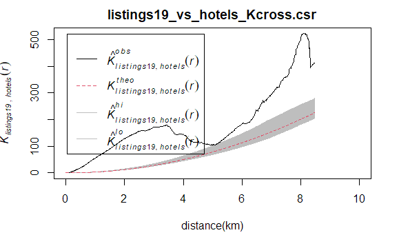

* From the graph above we can see the observed(black) line is above the envelop. Therefore, there is enough statistical evidence to reject the null hypothesis and say that the distribution of 2019 Airbnb listings and hotel locations are not independent spatially with each other at 99.9% confidence interval.

#### ii. listings19 vs tourism
```{r}
listings19_vs_tourism_Kcross <- Kcross(listings19_vs_tourism, 
                           i="listings19", j="tourism",
                           correction='border')
plot(listings19_vs_tourism_Kcross)
```

```{r, warning=FALSE, eval=FALSE}
listings19_vs_tourism_Kcross.csr <- envelope(listings19_vs_tourism, Kcross, i="listings19", j="tourism", correction='border', nsim=99)

plot(listings19_vs_tourism_Kcross.csr, xlab="distance(km)", xlim=c(0,10))
```

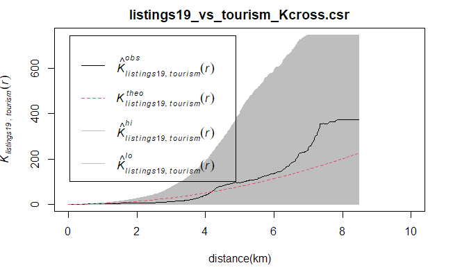

* From the graph above we can see the observed(black) line is within the envelop. Therefore, we failed to reject the null hypothesis. The distribution of 2019 Airbnb listings and tourism locations are independent spatially with each other at 99.9% confidence interval.

#### iii. listings19 vs MRT
```{r}
listings19_vs_MRT_Kcross <- Kcross(listings19_vs_MRT, 
                           i="listings19", j="MRT",
                           correction='border')
plot(listings19_vs_MRT_Kcross)
```

* The plot above reveals that there is a sign that the marked spatial point events are not independent spatially. However, a hypothesis test is required to confirm the observation statistically.

```{r, warning=FALSE, eval=FALSE}
listings19_vs_MRT_Kcross.csr <- envelope(listings19_vs_MRT, Kcross, i="listings19", j="MRT", correction='border', nsim=99)

plot(listings19_vs_MRT_Kcross.csr, xlab="distance(m)", xlim=c(0,10))
```

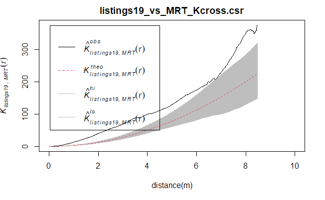

* From the graph above we can see the observed(black) line is above the envelop. Therefore, there is enough statistical evidence to reject the null hypothesis and say that the distribution of 2019 Airbnb listings and MRT locations are not independent spatially with each other at 99.9% confidence interval.

#### iv. listings19 vs hawker
```{r}
listings19_vs_hawker_Kcross <- Kcross(listings19_vs_hawker, 
                           i="listings19", j="hawker",
                           correction='border')
plot(listings19_vs_hawker_Kcross)
```

* The plot above reveals that there is a sign that the marked spatial point events are not independent spatially. However, a hypothesis test is required to confirm the observation statistically.

```{r, warning=FALSE, eval=FALSE}
listings19_vs_hawker_Kcross.csr <- envelope(listings19_vs_hawker, Kcross, i="listings19", j="hawker", correction='border', nsim=99)

plot(listings19_vs_hawker_Kcross.csr, xlab="distance(m)", xlim=c(0,10))
```

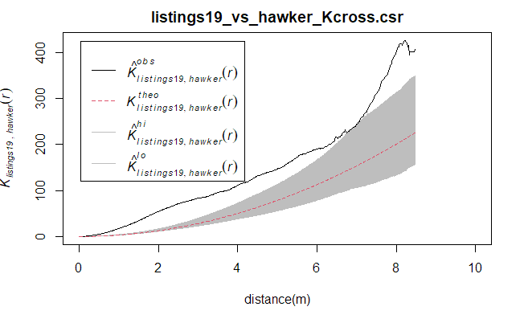

* From the graph above we can see the observed(black) line is above the envelop. Therefore, there is enough statistical evidence to reject the null hypothesis and say that the distribution of 2019 Airbnb listings and hawker center locations are not independent spatially with each other at 99.9% confidence interval.

#### v. listings19 vs bus
```{r}
listings19_vs_bus_Kcross <- Kcross(listings19_vs_bus, 
                           i="listings19", j="bus",
                           correction='border')
plot(listings19_vs_bus_Kcross)
```

* The plot above reveals that there is a sign that the marked spatial point events are not independent spatially. However, a hypothesis test is required to confirm the observation statistically.

```{r, warning=FALSE, eval=FALSE}
listings19_vs_bus_Kcross.csr <- envelope(listings19_vs_bus, Kcross, i="listings19", j="bus", correction='border', nsim=99)

plot(listings19_vs_bus_Kcross.csr, xlab="distance(m)", xlim=c(0,10))
```

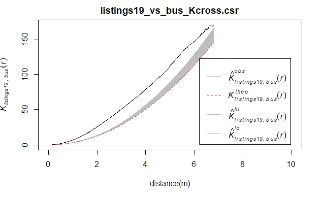

* From the graph above we can see the observed(black) line is above the envelop. Therefore, there is enough statistical evidence to reject the null hypothesis and say that the distribution of 2019 Airbnb listings and bus stop locations are not independent spatially with each other at 99.9% confidence interval.

## c. Second-order Multi-tpye Point Patterns Analysis: Cross L-Function

#### Note:
Cross L-Function and Cross K-Function are the actually the same but just Cross L-Function is the standardized version of Cross K-Function. Their CSR testing hypothesis, analysis and conclusions are all the same. I would just like to draw here the L-Functions for better visualization purpose.

#### i. listings19 vs hotels
```{r}
listings19_vs_hotels_Lcross <- Lcross(listings19_vs_hotels, 
                           i="listings19", j="hotels",
                           correction='border')
plot(listings19_vs_hotels_Lcross, . -r ~ r, 
     xlab = "distance(km)", 
     xlim=c(0, 10))
```
```{r, warning=FALSE, eval=FALSE}
listings19_vs_hotels_Lcross.csr <- envelope(listings19_vs_hotels, Lcross, i="listings19", j="hotels", correction='border', nsim=99)

plot(listings19_vs_hotels_Lcross.csr, . -r ~ r, xlab="distance(km)", xlim=c(0,10))
```

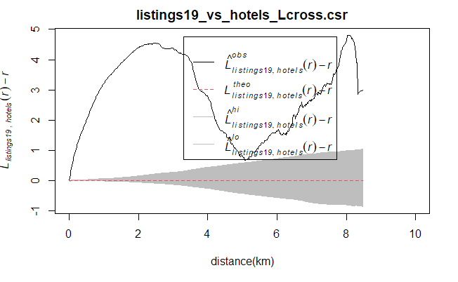

#### ii. listings19 vs tourism
```{r}
listings19_vs_tourism_Lcross <- Lcross(listings19_vs_tourism, 
                           i="listings19", j="tourism",
                           correction='border')
plot(listings19_vs_tourism_Lcross, . -r ~ r, 
     xlab = "distance(km)", 
     xlim=c(0, 10))
```
```{r, warning=FALSE, eval=FALSE}
listings19_vs_tourism_Lcross.csr <- envelope(listings19_vs_tourism, Lcross, i="listings19", j="tourism", correction='border', nsim=99)

plot(listings19_vs_tourism_Lcross.csr, . -r ~ r, xlab="distance(km)", xlim=c(0,10))
```

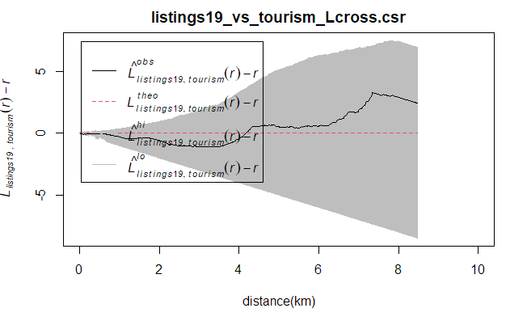

#### iii. listings19 vs MRT
```{r}
listings19_vs_MRT_Lcross <- Lcross(listings19_vs_MRT, 
                           i="listings19", j="MRT",
                           correction='border')
plot(listings19_vs_MRT_Lcross, . -r ~ r, 
     xlab = "distance(km)", 
     xlim=c(0, 10))
```
```{r, warning=FALSE, eval=FALSE}
listings19_vs_MRT_Lcross.csr <- envelope(listings19_vs_MRT, Lcross, i="listings19", j="MRT", correction='border', nsim=99)

plot(listings19_vs_MRT_Lcross.csr, . -r ~ r, xlab="distance(km)", xlim=c(0,10))
```

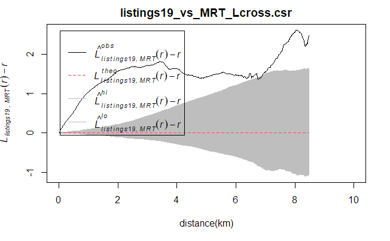

#### iv. listings19 vs hawker
```{r}
listings19_vs_hawker_Lcross <- Lcross(listings19_vs_hawker, 
                           i="listings19", j="hawker",
                           correction='border')
plot(listings19_vs_hawker_Lcross, . -r ~ r, 
     xlab = "distance(km)", 
     xlim=c(0, 10))
```
```{r, warning=FALSE, eval=FALSE}
listings19_vs_hawker_Lcross.csr <- envelope(listings19_vs_hawker, Lcross, i="listings19", j="hawker", correction='border', nsim=99)

plot(listings19_vs_hawker_Lcross.csr, . -r ~ r, xlab="distance(km)", xlim=c(0,10))
```

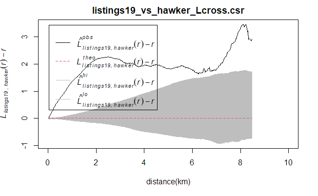

#### v. listings19 vs bus
```{r}
listings19_vs_bus_Lcross <- Lcross(listings19_vs_bus, 
                           i="listings19", j="bus",
                           correction='border')
plot(listings19_vs_bus_Lcross, . -r ~ r, 
     xlab = "distance(km)", 
     xlim=c(0, 10))
```
```{r, warning=FALSE, eval=FALSE}
listings19_vs_bus_Lcross.csr <- envelope(listings19_vs_bus, Lcross, i="listings19", j="bus", correction='border', nsim=99)

plot(listings19_vs_bus_Lcross.csr, . -r ~ r, xlab="distance(km)", xlim=c(0,10))
```

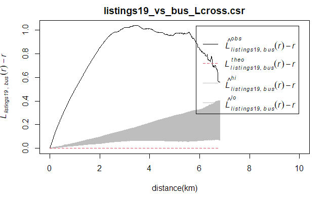

## d. Summary: Cross K-Function and Cross L-Function

From the above Cross K-Function and Cross L-Function analysis, we can see among the 5 location factors, 2019 Airbnb listings are not independent with hotels, MRT stations, hawker centres and bus stops. These are be the factors that may bring Airbnb customers and profit so these Airbnb are located there. However, 2019 Airbnb listings are independent with tourist attractions, this may because the tourist attractions are too few to compare or Airbnb customers do not need to live near those attractions due to convenient MRT. All these observations are in accord with the patterns we see in our KDE maps of First-order analysis.

# 5. Section B: Impact of COVID-19
# 5.1 First-order Spatial Point Patterns Analysis: A. Derive kernel density maps of all Airbnb listings and Airbnb by room type as at June 2019 and June 2021

## a. EDA and Geospatial data wrangling
#### check 2019 and 2020 room types
```{r}
unique(listings19_sf$"room_type")
unique(listings21_sf$"room_type")
```

* for 2019 Airbnbs there are 3 unique room types while for 2021 Airbnbs there are 4

#### filter important field and convert to SpatialPointsDataFrame
```{r}
listings19_sf <-listings19_sf %>%
  select(room_type)
listings21_sf <-listings21_sf %>%
  select(room_type)

listings19 <- as_Spatial(listings19_sf)
listings21 <- as_Spatial(listings21_sf)
```

#### change marked field to factor data type
```{r}
listings19@data$"room_type" <- as.factor(listings19@data$"room_type")
listings21@data$"room_type" <- as.factor(listings21@data$"room_type")
```

#### peek the distribution
```{r}
tmap_mode("plot")
tm_shape(sg) +
  tm_borders(alpha = 0.5) +
tm_shape(listings19) +
  tm_dots(col = 'room_type', 
          size = 0.5) +
  tm_layout(title = "2019 room_type") +
tm_facets(by="room_type")

tm_shape(sg) +
  tm_borders(alpha = 0.5) +
tm_shape(listings21) +
  tm_dots(col = 'room_type', 
          size = 0.5) +
  tm_layout(title = "2021 room_type") +
tm_facets(by="room_type")
```

#### Convert the SpatialPointsDataFrame into ppp (point pattern in spatstat) format
```{r}
listings19_ppp <- as(listings19, "ppp")
listings21_ppp <- as(listings21, "ppp")

plot(listings19_ppp)
plot(listings21_ppp)
```
```{r}
summary(listings19_ppp)
summary(listings21_ppp)
```

* The reports above reveal that in 2019 Entire home/apt is the most common Airbnb type with a market share of 51%, followed by Private room and Shared room. However, in 2021 Private room is the most common Airbnb type with a market share of 48%, followed by Entire home/apt, Hotel room and Shared room.
* It is also important to node that the spatial point object contains duplicated points.

#### Avoiding duplicated spatial point event by using jittering method
```{r}
listings19_ppp_jit <- rjitter(listings19_ppp, retry=TRUE, nsim=1, drop=TRUE)
listings21_ppp_jit <- rjitter(listings21_ppp, retry=TRUE, nsim=1, drop=TRUE)
any(duplicated(listings19_ppp_jit))
any(duplicated(listings21_ppp_jit))
```

#### COMBINING ppp AND owin object
```{r}
listings19SG_ppp = listings19_ppp_jit[sg_owin]
listings21SG_ppp = listings21_ppp_jit[sg_owin]

plot(listings19SG_ppp)
plot(listings21SG_ppp)
```

## b. Compute kernel density estimation using fixed bandwidth

* Since I am going to compare Airbnb listings across time, I would like to make the bandwidth a fixed value for standard comparison. The bandwidth chosen is 0.18 (180 meters) referring to part A bw.ppl.

```{r, warning = FALSE, fig.width=20, fig.height=30}
par(mar=c(1,1,1,1))
par(mfrow=c(2,2))
# Rescale KDE values: covert the unit of measurement from meter to kilometer.
listings19SG_ppp.km <- rescale(listings19SG_ppp, 1000, "km")
#plot
kde_listings19SG_km_split <-density(split(listings19SG_ppp.km),
                              sigma=0.18,
                              edge=TRUE,
                            kernel="gaussian")
plot(kde_listings19SG_km_split)

# Rescale KDE values: covert the unit of measurement from meter to kilometer.
listings21SG_ppp.km <- rescale(listings21SG_ppp, 1000, "km")
#plot
kde_listings21SG_km_split <-density(split(listings21SG_ppp.km),
                              sigma=0.18,
                              edge=TRUE,
                            kernel="gaussian")
plot(kde_listings21SG_km_split)
```
```{r}
intensity(listings19SG_ppp.km)
intensity(listings21SG_ppp.km)
```

* The output reveals that in 2019 Entire home/apt type Airbnb has the highest density of 5.7 units per km square, followed by 4.78 units per km square for Private room and 0.6 unit per km square  for Shared room. However, in 2021, Private room has the highest density of 2.74 units per km square, followed by 2.43 units per km square for Entire home/apt, 0.26 units per km square for Hotel room and 0.23 unit per km square for Shared room.

## c. Convert KDE output into raster and display the kernel density maps on openstreetmap of Singapore
```{r, warning=FALSE}
#split
kde_listings19SG_EH<-kde_listings19SG_km_split[[1]]
kde_listings19SG_PR<-kde_listings19SG_km_split[[2]]
kde_listings19SG_SR<-kde_listings19SG_km_split[[3]]

kde_listings21SG_EH<-kde_listings21SG_km_split[[1]]
kde_listings21SG_HR<-kde_listings21SG_km_split[[2]]
kde_listings21SG_PR<-kde_listings21SG_km_split[[3]]
kde_listings21SG_SR<-kde_listings21SG_km_split[[4]]

# convert KDE output into grid
gridded_kde_listings19SG_EH <- as.SpatialGridDataFrame.im(kde_listings19SG_EH)
gridded_kde_listings19SG_PR <- as.SpatialGridDataFrame.im(kde_listings19SG_PR)
gridded_kde_listings19SG_SR <- as.SpatialGridDataFrame.im(kde_listings19SG_SR)

gridded_kde_listings21SG_EH <- as.SpatialGridDataFrame.im(kde_listings21SG_EH)
gridded_kde_listings21SG_HR <- as.SpatialGridDataFrame.im(kde_listings21SG_HR)
gridded_kde_listings21SG_PR <- as.SpatialGridDataFrame.im(kde_listings21SG_PR)
gridded_kde_listings21SG_SR <- as.SpatialGridDataFrame.im(kde_listings21SG_SR)

# convert gridded output into raster
kde_listings19SG_EH_raster <- raster(gridded_kde_listings19SG_EH)
kde_listings19SG_PR_raster <- raster(gridded_kde_listings19SG_PR)
kde_listings19SG_SR_raster <- raster(gridded_kde_listings19SG_SR)

kde_listings21SG_EH_raster <- raster(gridded_kde_listings21SG_EH)
kde_listings21SG_HR_raster <- raster(gridded_kde_listings21SG_HR)
kde_listings21SG_PR_raster <- raster(gridded_kde_listings21SG_PR)
kde_listings21SG_SR_raster <- raster(gridded_kde_listings21SG_SR)

# assign projection system to raster
projection(kde_listings19SG_EH_raster) <- CRS("+init=EPSG:3414 +datum=WGS84 +units=km")
projection(kde_listings19SG_PR_raster) <- CRS("+init=EPSG:3414 +datum=WGS84 +units=km")
projection(kde_listings19SG_SR_raster) <- CRS("+init=EPSG:3414 +datum=WGS84 +units=km")

projection(kde_listings21SG_EH_raster) <- CRS("+init=EPSG:3414 +datum=WGS84 +units=km")
projection(kde_listings21SG_HR_raster) <- CRS("+init=EPSG:3414 +datum=WGS84 +units=km")
projection(kde_listings21SG_PR_raster) <- CRS("+init=EPSG:3414 +datum=WGS84 +units=km")
projection(kde_listings21SG_SR_raster) <- CRS("+init=EPSG:3414 +datum=WGS84 +units=km")
```

```{r, warning = FALSE,  fig.width=20, fig.height=30}
# visualise the raster kernel density maps on openstreetmap of Singapore
tmap_mode("view")
tmap_options(check.and.fix = TRUE)

listings19SG_EH_osmap <- tm_shape(sg_sf) +
  tm_borders(col = 'black',
             lwd = 1,
             alpha = 0.5) +
  tm_shape(kde_listings19SG_EH_raster) + 
  tm_raster("v",breaks=c(0, 50, 100, 150, 200, 250, 300, 350, 400, 1000), alpha = 0.7) +
  tm_layout(legend.outside = TRUE, frame = FALSE, title = "2019 Entire home/apt KDE") + 
  tm_basemap('OpenStreetMap')

listings21SG_EH_osmap <- tm_shape(sg_sf) +
  tm_borders(col = 'black',
             lwd = 1,
             alpha = 0.5) +
  tm_shape(kde_listings21SG_EH_raster) + 
  tm_raster("v",breaks=c(0, 50, 100, 150, 200, 250, 300, 350, 400, 1000),alpha = 0.7) +
  tm_layout(legend.outside = TRUE, frame = FALSE, title = "2021 Entire home/apt KDE") + 
  tm_basemap('OpenStreetMap')

listings19SG_PR_osmap <- tm_shape(sg_sf) +
  tm_borders(col = 'black',
             lwd = 1,
             alpha = 0.5) +
  tm_shape(kde_listings19SG_PR_raster) + 
  tm_raster("v",breaks=c(0, 50, 100, 150, 200, 250, 300, 350, 400, 1000),alpha = 0.7) +
  tm_layout(legend.outside = TRUE, frame = FALSE, title = "2019 Private Room KDE") + 
  tm_basemap('OpenStreetMap')

listings21SG_PR_osmap <- tm_shape(sg_sf) +
  tm_borders(col = 'black',
             lwd = 1,
             alpha = 0.5) +
  tm_shape(kde_listings21SG_PR_raster) + 
  tm_raster("v",breaks=c(0, 50, 100, 150, 200, 250, 300, 350, 400, 1000),alpha = 0.7) +
  tm_layout(legend.outside = TRUE, frame = FALSE, title = "2021 Private Room KDE") + 
  tm_basemap('OpenStreetMap')

listings19SG_SR_osmap <- tm_shape(sg_sf) +
  tm_borders(col = 'black',
             lwd = 1,
             alpha = 0.5) +
  tm_shape(kde_listings19SG_SR_raster) + 
  tm_raster("v",breaks=c(0, 10, 20, 30, 40, 50, 60, 70, 80, 100),alpha = 0.7) +
  tm_layout(legend.outside = TRUE, frame = FALSE, title = "2019 Shared Room KDE") + 
  tm_basemap('OpenStreetMap')

listings21SG_SR_osmap <- tm_shape(sg_sf) +
  tm_borders(col = 'black',
             lwd = 1,
             alpha = 0.5) +
  tm_shape(kde_listings21SG_SR_raster) + 
  tm_raster("v",breaks=c(0, 10, 20, 30, 40, 50, 60, 70, 80, 100),alpha = 0.7) +
  tm_layout(legend.outside = TRUE, frame = FALSE, title = "2021 Shared Room KDE") + 
  tm_basemap('OpenStreetMap')

listings21SG_HR_osmap <- tm_shape(sg_sf) +
  tm_borders(col = 'black',
             lwd = 1,
             alpha = 0.5) +
  tm_shape(kde_listings21SG_HR_raster) + 
  tm_raster("v",breaks=c(0, 10, 20, 30, 40, 50, 60, 70, 80, 100),alpha = 0.7) +
  tm_layout(legend.outside = TRUE, frame = FALSE, title = "2021 Hotel Room KDE") + 
  tm_basemap('OpenStreetMap')

tmap_arrange(listings19SG_EH_osmap,listings21SG_EH_osmap, listings19SG_PR_osmap, listings21SG_PR_osmap, listings19SG_SR_osmap, listings21SG_SR_osmap, listings21SG_HR_osmap, asp=2, ncol=2)

tmap_mode('plot')
```

* From the above kernel density maps, within a bandwidth of 180 meters:
  + For Entire Home type, there is an obvious decrease from around 300 in 2019 to around 100 in 2021 while the overall spatial patterns remain the same.
  + For Private Room type, there is a slight decrease from 2019 to 2021 while the overall spatial patterns remain the same.
  + For Shared Room type, there is an obvious decrease from around 75 in 2019 to around 35 in 2021 while the overall spatial patterns remain the same.
  + For Hotel Room type, there was no such type in 2019 but it increased up to around 45 in 2021.
  + Across spaces, four types of Airbnb all have similar patterns and are clustered around "Suntec City", i.e. the central district area of Singapore.

# 5.2 Second-order Spatial Point Patterns Analysis: G-Function and F-Function

* In order to analyse the impact of COVID-19 on Airbnb business in Singapore, besides focusing on the change in density which is evaluated by KDE, I am going to use G-Function and F-Function to analyse the distribution of Airbnb business in 2019 and 2021, focusing on the extent of randomness/clustering.
* Types of Airbnbs for analysis: Entire Home type, Private Room type, Shared Room type. Since Hotel Room type only exists in 2021, it will not be my main focus for this study.

## Note
For each function used, I will also perform a Complete Spatial Randomness(CSR) testing on it. The hypothesis are the same for both functions:

The hypothesis are as follows:
  + H0 = The distribution of that type of Airbnb are randomly distributed in Singapore.
  + H1= The distribution of that type of Airbnb are not randomly distributed in Singapore.
  + The null hypothesis will be rejected if p-value is smaller than alpha value of 0.01 (i.e. at 99% confident interval).

## a. Prepare split ppp objects
```{r}
listings19SG_EH <- split(listings19SG_ppp.km)[[1]]
listings19SG_PR <- split(listings19SG_ppp.km)[[2]]
listings19SG_SR <- split(listings19SG_ppp.km)[[3]]

listings21SG_EH <- split(listings21SG_ppp.km)[[1]]
listings21SG_PR <- split(listings21SG_ppp.km)[[3]]
listings21SG_SR <- split(listings21SG_ppp.km)[[4]]
```

## b. Analysing Spatial Point Process Using G-Function

* The G function measures the distribution of the distances from an arbitrary event to its nearest event.


#### Entire Home
```{r, warning=FALSE}
# 2019
G_19_EH = Gest(listings19SG_EH, correction = "border")
plot(G_19_EH, xlim=c(0,1))
```
```{r, warning=FALSE, eval=FALSE}
#MONTE CARLO TEST WITH G-FUCNTION
G_19_EH.csr <- envelope(listings19SG_EH, Gest, nsim = 99)
plot(G_19_EH.csr, xlim=c(0,1))
```

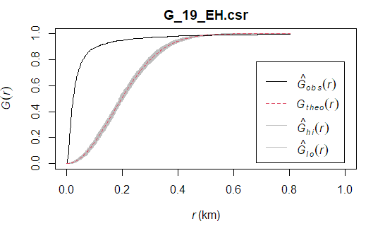
* From 0km to 0.5km, the observed(black) line is above the envelop, indicating there is enough evidence to reject the null hypothesis and say that Entire Home Airbnbs resemble clustered pattern. This can also be seen as G increases rapidly at short distance above the theoretical(red) line. However, from about 0.5km onward, we noticed that the observed(black) line goes along with (in) the envelope. This means that there is not enough evidence to reject the null hypothesis and suggesting Entire Home Airbnbs resemble randomness above 0.5m.

```{r, warning=FALSE}
# 2021
G_21_EH = Gest(listings21SG_EH, correction = "border")
plot(G_21_EH, xlim=c(0,1))
```
```{r, warning=FALSE, eval=FALSE}
#MONTE CARLO TEST WITH G-FUCNTION
G_21_EH.csr <- envelope(listings21SG_EH, Gest, nsim = 99)
plot(G_21_EH.csr, xlim=c(0,1))
```

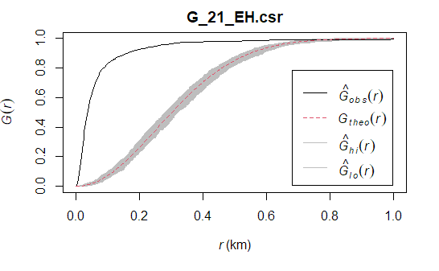
* Compared with 2019 Entire Home Airbnbs, similar patterns can be observed for 2021 Entire Home Airbnbs. However, for 2021 Entire Home Airbnbs, the part outside the envelop is longer, ranging from 0km to 0.8km.

#### Private Room
```{r, warning=FALSE}
# 2019
G_19_PR = Gest(listings19SG_PR, correction = "border")
plot(G_19_PR, xlim=c(0,1))
```
```{r, warning=FALSE, eval=FALSE}
#MONTE CARLO TEST WITH G-FUCNTION
G_19_PR.csr <- envelope(listings19SG_PR, Gest, nsim = 99)
plot(G_19_PR.csr, xlim=c(0,1))
```

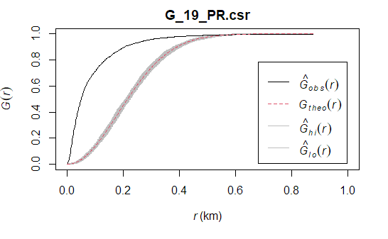

* From 0km to 0.6km, the observed(black) line is above the envelop, indicating there is enough evidence to reject the null hypothesis and say that Private Room Airbnbs resemble clustered pattern. This can also be seen as G increases rapidly at short distance above the theoretical(red) line. However, from about 0.6km onward, we noticed that the observed(black) line goes along with (in) the envelope. This means that there is not enough evidence to reject the null hypothesis and suggesting Private Room Airbnbs resemble randomness above 0.5m.

```{r, warning=FALSE}
# 2021
G_21_PR = Gest(listings21SG_PR, correction = "border")
plot(G_21_PR, xlim=c(0,1))
```
```{r, warning=FALSE, eval=FALSE}
#MONTE CARLO TEST WITH G-FUCNTION
G_21_PR.csr <- envelope(listings21SG_PR, Gest, nsim = 99)
plot(G_21_PR.csr, xlim=c(0,1))
```

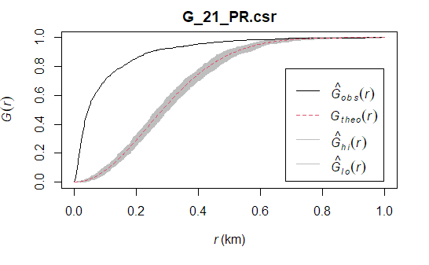

* Compared with 2019 Private Room Airbnbs, similar patterns can be observed for 2021 Private Room Airbnbs. However, for 2021 Private Room Airbnbs, the part outside the envelop is longer, ranging from 0km to 0.8km.

#### Shared Room
```{r, warning=FALSE}
# 2019
G_19_SR = Gest(listings19SG_SR, correction = "border")
plot(G_19_SR, xlim=c(0,2))
```
```{r, warning=FALSE, eval=FALSE}
#MONTE CARLO TEST WITH G-FUCNTION
G_19_SR.csr <- envelope(listings19SG_SR, Gest, nsim = 99)
plot(G_19_SR.csr, xlim=c(0,2))
```

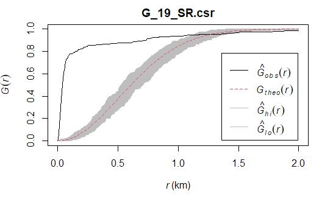

* From 0km to 1.2km, the observed(black) line is above the envelop, indicating there is enough evidence to reject the null hypothesis and say that Shared Room Airbnbs resemble clustered pattern. This can also be seen as G increases rapidly at short distance above the theoretical(red) line. However, from about 1.2km onward, we noticed that the observed(black) line goes into (along with) the envelope. This means that there is not enough evidence to reject the null hypothesis and suggesting Shared Room Airbnbs resemble randomness or regular pattern above 1.2m.

```{r, warning=FALSE}
# 2021
G_21_SR = Gest(listings21SG_SR, correction = "border")
plot(G_21_SR, xlim=c(0,2))
```
```{r, warning=FALSE, eval=FALSE}
#MONTE CARLO TEST WITH G-FUCNTION
G_21_SR.csr <- envelope(listings21SG_SR, Gest, nsim = 99)
plot(G_21_SR.csr, xlim=c(0,2))
```

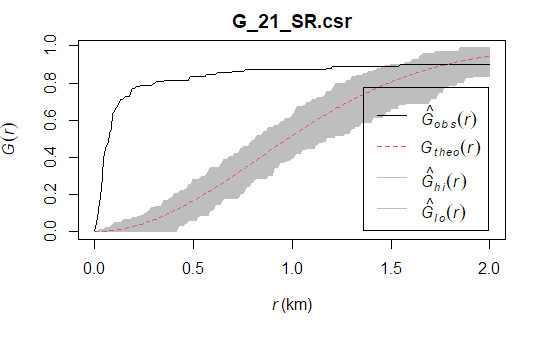

* Compared with 2019 Shared Room Airbnbs, similar patterns can be observed for 2021 Shared Room Airbnbs. However, for 2021 Shared Room Airbnbs, the part outside the envelop is shorter, ranging from 0km to 1.4km.

## c. Analysing Spatial Point Process Using F-Function

* The F function select a sample of point locations anywhere in the study region at random and determine minimum distance from each point to any event in the study area.


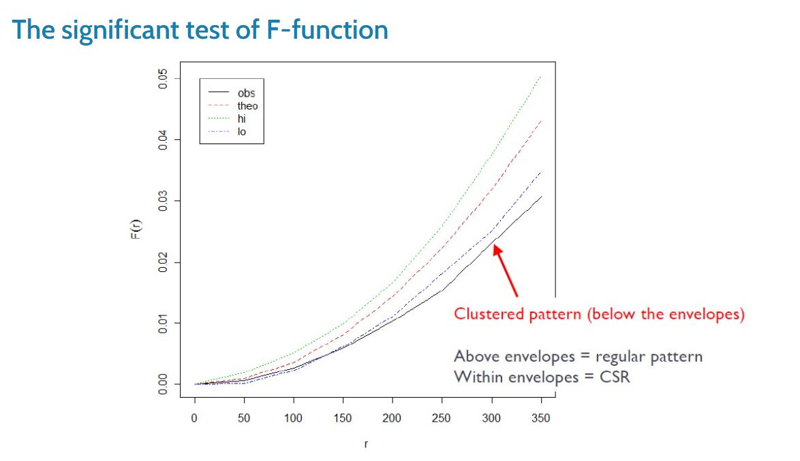

#### Entire Home
```{r, warning=FALSE}
#2019
F_19_EH = Fest(listings19SG_EH)
plot(F_19_EH, xlim=c(0,1))
```
```{r, warning=FALSE, eval=FALSE}
#MONTE CARLO TEST WITH F-FUCNTION
F_19_EH.csr <- envelope(listings19SG_EH, Fest, nsim = 99)
plot(F_19_EH.csr, xlim=c(0,1))
```

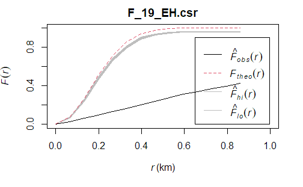

* From the graph above we can see the observed(black) line is below the envelop, indicating there is enough evidence to reject the null hypothesis and say that Entire Home Airbnbs resemble clustered pattern at 99% confidence interval.

```{r, warning=FALSE}
#2021
F_21_EH = Fest(listings21SG_EH)
plot(F_21_EH, xlim=c(0,1))
```
```{r, warning=FALSE, eval=FALSE}
#MONTE CARLO TEST WITH F-FUCNTION
F_21_EH.csr <- envelope(listings21SG_EH, Fest, nsim = 99)
plot(F_21_EH.csr, xlim=c(0,1))
```

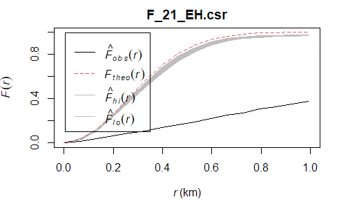

* 2021 Entire Home Airbnbs F-function has similar pattern compared to 2019 Entire Home Airbnbs's.

#### Private Room
```{r, warning=FALSE}
#2019
F_19_PR = Fest(listings19SG_PR)
plot(F_19_PR, xlim=c(0,1))
```
```{r, warning=FALSE, eval=FALSE}
#MONTE CARLO TEST WITH F-FUCNTION
F_19_PR.csr <- envelope(listings19SG_PR, Fest, nsim = 99)
plot(F_19_PR.csr, xlim=c(0,1))
```


* From the graph above we can see the observed(black) line is below the envelop, indicating there is enough evidence to reject the null hypothesis and say that Private Room Airbnbs resemble clustered pattern at 99% confidence interval.

```{r, warning=FALSE}
#2021
F_21_PR = Fest(listings21SG_PR)
plot(F_21_PR, xlim=c(0,1))
```
```{r, warning=FALSE, eval=FALSE}
#MONTE CARLO TEST WITH F-FUCNTION
F_21_PR.csr <- envelope(listings21SG_PR, Fest, nsim = 99)
plot(F_21_PR.csr, xlim=c(0,1))
```

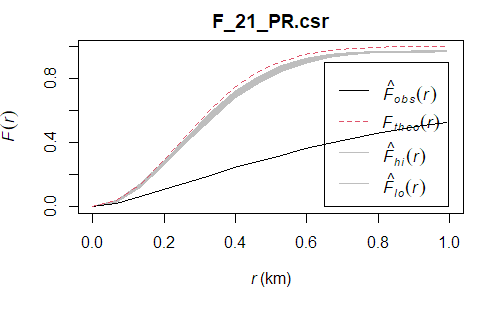

* 2021 Private Room Airbnbs F-function has similar pattern compared to 2019 Private Room Airbnbs's.

#### Shared Room
```{r, warning=FALSE}
#2019
F_19_SR = Fest(listings19SG_SR)
plot(F_19_SR, xlim=c(0,1))
```
```{r, warning=FALSE, eval=FALSE}
#MONTE CARLO TEST WITH F-FUCNTION
F_19_SR.csr <- envelope(listings19SG_SR, Fest, nsim = 99)
plot(F_19_SR.csr, xlim=c(0,1))
```

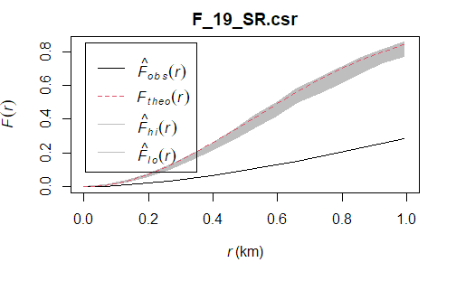

* From the graph above we can see the observed(black) line is below the envelop, indicating there is enough evidence to reject the null hypothesis and say that Shared Room Airbnbs resemble clustered pattern at 99% confidence interval. 

```{r, warning=FALSE}
#2021
F_21_SR = Fest(listings21SG_SR)
plot(F_21_SR, xlim=c(0,1))
```
```{r, warning=FALSE, eval=FALSE}
#MONTE CARLO TEST WITH F-FUCNTION
F_21_SR.csr <- envelope(listings21SG_SR, Fest, nsim = 99)
plot(F_21_SR.csr, xlim=c(0,1))
```

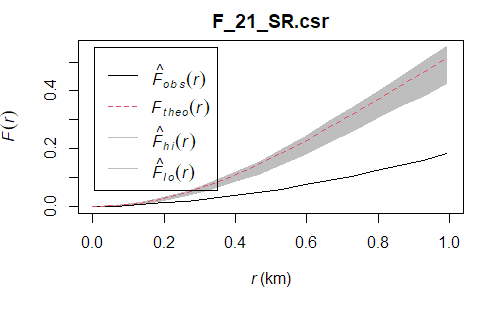

* 2021 Shared Room Airbnbs F-function has similar pattern compared to 2019 Shared Room Airbnbs's.

## d. Summary: G-Function and K-Function

From the G-Function and K-Function analysis above, we can see for all types of Airbnbs in both 2019 and 2021 resemble cluster patterns within a distance and gradually resemble randomness or regular pattern when the distance increases. Usually, 2021 Airbnbs have a longer distance that resemble cluster patterns than 2019 Airbnbs. This may because the tightness of clusters in 2021 is lesser than that of clusters in 2019, as can be seen in our KDE maps of First-order analysis. In general, there are fewer Airbnbs in 2021 after covid but their locations and distributions are still similar to Airbnbs in 2019.

