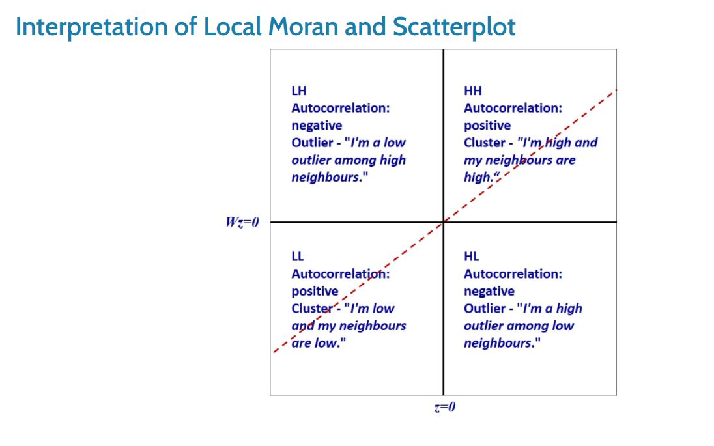

```{r setup, include=FALSE}
knitr::opts_chunk$set(echo = TRUE)
```

* In this case study, we are interested to examine the spatial pattern of a selected development indicator (i.e. GDP per capita) of Hunan Provice, People Republic of China.

# 1. Install Packages

```{r}
packages = c('sf', 'spdep', 'tmap', 'tidyverse')
for (p in packages){
  if(!require(p, character.only = T)){
    install.packages(p)
  }
  library(p,character.only = T)
}
```

# 2. Import data, performe relational join and peek the indicator

```{r}
hunan <- st_read(dsn = "data/shapefile", 
                 layer = "Hunan")
hunan2012 <- read_csv("data/attribute/Hunan_2012.csv")
hunan <- left_join(hunan,hunan2012)
```
```{r}
equal <- tm_shape(hunan) +
  tm_fill("GDPPC",
          n = 5,
          style = "equal") +
  tm_borders(alpha = 0.5) +
  tm_layout(main.title = "Equal interval classification")

quantile <- tm_shape(hunan) +
  tm_fill("GDPPC",
          n = 5,
          style = "quantile") +
  tm_borders(alpha = 0.5) +
  tm_layout(main.title = "Equal quantile classification")

tmap_arrange(equal, 
             quantile, 
             asp=1, 
             ncol=2)
```

# 3. Global Spatial Autocorrelation

## a. Computing Queen Contiguity Spatial Weights matrix
```{r}
wm_q <- poly2nb(hunan, 
                queen=TRUE) #if queen=FALSE, it is using rook
summary(wm_q)
```

* The summary report above shows that there are 88 area units in Hunan. The most connected area unit has 11 neighbours. There are two area units with only one heighbours.

## b. Row-standardised weights matrix
```{r}
rswm_q <- nb2listw(wm_q, 
                   style="W", 
                   zero.policy = TRUE)
rswm_q
```

* style can take values “W”, “B”, “C”, “U”, “minmax” and “S”. B is the basic binary coding, W is row standardised (sums over all links to n), C is globally standardised (sums over all links to n), U is equal to C divided by the number of neighbours (sums over all links to unity), while S is the variance-stabilizing coding scheme proposed by Tiefelsdorf et al. 1999, p. 167-168 (sums over all links to n).
* If zero policy is set to TRUE, weights vectors of zero length are inserted for regions without neighbour in the neighbours list. These will in turn generate lag values of zero, equivalent to the sum of products of the zero row t(rep(0, length=length(neighbours))) %*% x, for arbitrary numerical vector x of length length(neighbours). The spatially lagged value of x for the zero-neighbour region will then be zero, which may (or may not) be a sensible choice.

## c. Global Spatial Autocorrelation: Moran’s I
#### performs Moran’s I statistical testing
```{r}
moran.test(hunan$GDPPC, 
           listw=rswm_q, 
           zero.policy = TRUE, 
           na.action=na.omit)

```

#### performs permutation test for Moran’s I statistic
```{r}
set.seed(1234)
bperm= moran.mc(hunan$GDPPC, 
                listw=rswm_q, 
                nsim=999, 
                zero.policy = TRUE, 
                na.action=na.omit)
bperm
```

#### Visualising Monte Carlo Moran’s I: histogram
```{r}
mean(bperm$res[1:999])
var(bperm$res[1:999])
summary(bperm$res[1:999])
hist(bperm$res, 
     freq=TRUE, 
     breaks=20, 
     xlab="Simulated Moran's I")
abline(v=0, 
       col="red") 
```

## d. Global Spatial Autocorrelation: Geary’s
#### performs Geary’s C test
```{r}
geary.test(hunan$GDPPC, listw=rswm_q)
```

#### performs permutation test for Geary’s C statistic
```{r}
set.seed(1234)
bperm=geary.mc(hunan$GDPPC, 
               listw=rswm_q, 
               nsim=999)
bperm
```

#### Visualising the Monte Carlo Geary’s C: histogram
```{r}
mean(bperm$res[1:999])
var(bperm$res[1:999])
summary(bperm$res[1:999])
hist(bperm$res, freq=TRUE, breaks=20, xlab="Simulated Geary c")
abline(v=1, col="red") 
```

## e. Spatial Correlogram

* Spatial correlograms show how correlated are pairs of spatial observations when you increase the distance (lag) between them - they are plots of some index of autocorrelation (Moran’s I or Geary’s c) against distance.

#### Compute Moran’s I correlogram
```{r}
#compute a 6-lag spatial correlogram of GDPPC. The global spatial autocorrelation used in Moran’s I. 
MI_corr <- sp.correlogram(wm_q, 
                          hunan$GDPPC, 
                          order=6, 
                          method="I", 
                          style="W")
plot(MI_corr)
```

* By plotting the output might not allow us to provide complete interpretation. This is because not all autocorrelation values are statistically significant. Hence, it is important for us to examine the full analysis report by printing out the analysis results.

```{r}
print(MI_corr)
```

#### Compute Geary’s C correlogram and plot
```{r}
#compute a 6-lag spatial correlogram of GDPPC. The global spatial autocorrelation used in Geary’s C.
GC_corr <- sp.correlogram(wm_q, 
                          hunan$GDPPC, 
                          order=6, 
                          method="C", 
                          style="W")
plot(GC_corr)
```
```{r}
print(GC_corr)
```

# 4. Cluster and Outlier Analysis

* Local Indicators of Spatial Association or LISA are statistics that evaluate the existence of clusters in the spatial arrangement of a given variable. For instance if we are studying cancer rates among census tracts in a given city local clusters in the rates mean that there are areas that have higher or lower rates than is to be expected by chance alone; that is, the values occurring are above or below those of a random distribution in space.
* In this section, you will learn how to apply appropriate Local Indicators for Spatial Association (LISA), especially local Moran’I to detect cluster(where are the clusters) and/or outlier from GDP per capita 2012 of Hunan Province, PRC.

## a. Computing local Moran’s I
```{r}
# localmoran() function computes Ii values, given a set of zi values and a listw object providing neighbour weighting information for the polygon associated with the zi values.
fips <- order(hunan$County)
localMI <- localmoran(hunan$GDPPC, rswm_q)
head(localMI)
```

* Note: localmoran() function returns a matrix of values whose columns are:
  + Ii: the local Moran’s I statistics
  + E.Ii: the expectation of local moran statistic under the randomisation hypothesis
  + Var.Ii: the variance of local moran statistic under the randomisation hypothesis
  + Z.Ii:the standard deviate of local moran statistic
Pr(): the p-value of local moran statistic

#### list the content of the local Moran matrix
```{r}
printCoefmat(data.frame(localMI[fips,], row.names=hunan$County[fips]), check.names=FALSE)
```

## b. Mapping the local Moran’s I
#### append the local Moran’s I dataframe (i.e. localMI) onto hunan SpatialPolygonDataFrame
```{r}
hunan.localMI <- cbind(hunan,localMI) %>%
  rename(Pr.Ii = Pr.z....E.Ii..)
```

#### Mapping local Moran’s I values
```{r}
tm_shape(hunan.localMI) +
  tm_fill(col = "Ii", 
          style = "pretty",
          palette = "RdBu",
          title = "local moran statistics") +
  tm_borders(alpha = 0.5)
```

#### Mapping local Moran’s I p-values
```{r}
tm_shape(hunan.localMI) +
  tm_fill(col = "Pr.Ii", 
          breaks=c(-Inf, 0.001, 0.01, 0.05, 0.1, Inf),
          palette="-Blues", 
          title = "local Moran's I p-values") +
  tm_borders(alpha = 0.5)
```

#### Mapping both local Moran’s I values and p-values
```{r}
localMI.map <- tm_shape(hunan.localMI) +
  tm_fill(col = "Ii", 
          style = "pretty", 
          title = "local moran statistics") +
  tm_borders(alpha = 0.5)

pvalue.map <- tm_shape(hunan.localMI) +
  tm_fill(col = "Pr.Ii", 
          breaks=c(-Inf, 0.001, 0.01, 0.05, 0.1, Inf),
          palette="-Blues", 
          title = "local Moran's I p-values") +
  tm_borders(alpha = 0.5)

tmap_arrange(localMI.map, pvalue.map, asp=1, ncol=2)
```

## c. Creating a LISA Cluster Map

* The LISA Cluster Map shows the significant locations color coded by type of spatial autocorrelation.

#### Plotting Moran scatterplot

* The Moran scatterplot is an illustration of the relationship between the values of the chosen attribute at each location and the average value of the same attribute at neighboring locations.

```{r}
nci <- moran.plot(hunan$GDPPC, rswm_q,
                  labels=as.character(hunan$County), 
                  xlab="GDPPC 2012", 
                  ylab="Spatially Lag GDPPC 2012")
```

* Notice that the plot is split in 4 quadrants. The top right corner belongs to areas that have high GDPPC and are surrounded by other areas that have the average level of GDPPC. This are the high-high locations in the lesson slide.

#### Plotting Moran scatterplot with standardised variable
```{r}
#First we will use scale() to centers and scales the variable. Here centering is done by subtracting the mean (omitting NAs) the corresponding columns, and scaling is done by dividing the (centered) variable by their standard deviations.
#The as.vector() added to the end is to make sure that the data type we get out of this is a vector, that map neatly into out dataframe.

hunan$Z.GDPPC <- scale(hunan$GDPPC) %>% as.vector 

nci2 <- moran.plot(hunan$Z.GDPPC, rswm_q,
                   labels=as.character(hunan$County),
                   xlab="z-GDPPC 2012", 
                   ylab="Spatially Lag z-GDPPC 2012")
```



#### Preparing LISA map classes
```{r}
quadrant <- vector(mode="numeric",length=nrow(localMI))
DV <- hunan$GDPPC - mean(hunan$GDPPC) #  center the variable of interest around its mean
C_mI <- localMI[,1] - mean(localMI[,1]) # center the local Moran’s around the mean
signif <- 0.05 # set a statistical significance level for the local Moran

# These four command lines define the high-high, low-low, low-high and high-low categories
quadrant[DV >0 & C_mI>0] <- 4      
quadrant[DV <0 & C_mI<0] <- 1      
quadrant[DV <0 & C_mI>0] <- 2
quadrant[DV >0 & C_mI<0] <- 3

#places non-significant Moran in the category 0
quadrant[localMI[,5]>signif] <- 0
```

#### Plotting LISA map
```{r}
hunan.localMI$quadrant <- quadrant
colors <- c("#ffffff", "#2c7bb6", "#abd9e9", "#fdae61", "#d7191c")
clusters <- c("insignificant", "low-low", "low-high", "high-low", "high-high")

tm_shape(hunan.localMI) +
  tm_fill(col = "quadrant", 
          style = "cat", 
          palette = colors[c(sort(unique(quadrant)))+1], 
          labels = clusters[c(sort(unique(quadrant)))+1],
          popup.vars = c("")) +
  tm_view(set.zoom.limits = c(11,17)) +
  tm_borders(alpha=0.5)
```

#### plot both the local Moran’s I values map and its corresponding p-values map
```{r}
gdppc <- qtm(hunan, "GDPPC")

hunan.localMI$quadrant <- quadrant
colors <- c("#ffffff", "#2c7bb6", "#abd9e9", "#fdae61", "#d7191c")
clusters <- c("insignificant", "low-high", "low-low", "high-low", "high-high")

LISAmap <- tm_shape(hunan.localMI) +
  tm_fill(col = "quadrant", 
          style = "cat", 
          palette = colors[c(sort(unique(quadrant)))+1], 
          labels = clusters[c(sort(unique(quadrant)))+1],
          popup.vars = c("")) +
  tm_view(set.zoom.limits = c(11,17)) +
  tm_borders(alpha=0.5)

tmap_arrange(gdppc, LISAmap, asp=1, ncol=2)
```

# 5. Hot Spot and Cold Spot Area Analysis

* Beside detecting cluster and outliers, localised spatial statistics can be also used to detect hot spot and/or cold spot areas.
* The term ‘hot spot’ has been used generically across disciplines to describe a region or value that is higher relative to its surroundings (Lepers et al 2005, Aben et al 2012, Isobe et al 2015).
* An alternative spatial statistics to detect spatial anomalies is the Getis and Ord’s G-statistics (Getis and Ord, 1972; Ord and Getis, 1995). It looks at neighbours within a defined proximity to identify where either high or low values clutser spatially. Here, statistically significant hot-spots are recognised as areas of high values where other areas within a neighbourhood range also share high values too.

## a. Deriving distance-based weight matrix

* First, we need to define a new set of neighbours. Whist the spatial autocorrelation considered units which shared borders, for Getis-Ord we are defining neighbours based on distance.
* There are two type of distance-based proximity matrix, they are:
  + fixed diatnce weight matrix
  + adaptive distance weight matrix

#### Deriving the centroid

* We will need points to associate with each polygon before we can make our connectivity graph. It will be a little more complicated than just running st_centroid() on the sf object: us.bound. We do this method because we want to reduce the time complexity for running st_centroid().

```{r}
longitude <- map_dbl(hunan$geometry, ~st_centroid(.x)[[1]])
latitude <- map_dbl(hunan$geometry, ~st_centroid(.x)[[2]])
coords <- cbind(longitude, latitude)
```

#### Determine the cut-off distance
```{r}
#coords <- coordinates(hunan)

#Return a matrix with the indices of points belonging to the set of the k nearest neighbours of each other
#Convert the knn object returned by knearneigh() into a neighbours list of class nb with a list of integer vectors containing neighbour region number ids
k1 <- knn2nb(knearneigh(coords))

#Return the length of neighbour relationship edges
#The function returns in the units of the coordinates if the coordinates are projected, in km otherwise.
k1dists <- unlist(nbdists(k1, coords, longlat = TRUE))
summary(k1dists)
```

* The summary report shows that the largest first nearest neighbour distance is 61.79 km, so using this as the upper threshold gives certainty that all units will have at least one neighbour.

#### Computing fixed distance weight matrix
```{r}
wm_d62 <- dnearneigh(coords, 0, 62, longlat = TRUE)
wm_d62

#convert the nb object into spatial weights object.
wm62_lw <- nb2listw(wm_d62, style = 'B')
summary(wm62_lw)
```

#### Computing adaptive distance weight matrix

* One of the characteristics of fixed distance weight matrix is that more densely settled areas (usually the urban areas) tend to have more neighbours and the less densely settled areas (usually the rural counties) tend to have lesser neighbours. Having many neighbours smoothes the neighbour relationship across more neighbours.
* It is possible to control the numbers of neighbours directly using k-nearest neighbours, either accepting asymmetric neighbours or imposing symmetry
```{r}
knn <- knn2nb(knearneigh(coords, k=8))
knn

# convert the nb object into spatial weights object.
knn_lw <- nb2listw(knn, style = 'B')
summary(knn_lw)
```

## b. Computing Gi statistics

#### i) Gi statistics using fixed distance
```{r}
fips <- order(hunan$County)
gi.fixed <- localG(hunan$GDPPC, wm62_lw)
gi.fixed
```

* The output of localG() is a vector of G or Gstar values, with attributes “gstari” set to TRUE or FALSE, “call” set to the function call, and class “localG”.
* The Gi statistics is represented as a Z-score. Greater values represent a greater intensity of clustering and the direction (positive or negative) indicates high or low clusters.

#### i) join the Gi values to their corresponding hunan sf data frame
```{r}
hunan.gi <- cbind(hunan, as.matrix(gi.fixed)) %>%
  rename(gstat_fixed = as.matrix.gi.fixed.)
```

* In fact, the code chunk above performs three tasks. First, it convert the output vector (i.e. gi.fixed) into r matrix object by using as.matrix(). Next, cbind() is used to join hun@data and gi.fixed matrix to produce a new SpatialPolygonDataFrame called hunan.gi. Lastly, the field name of the gi values is renamed to gstat_fixed by using names().

#### i) Mapping Gi values with fixed distance weights
```{r}
gdppc <- qtm(hunan, "GDPPC")

Gimap <-tm_shape(hunan.gi) +
  tm_fill(col = "gstat_fixed", 
          style = "pretty",
          palette="-RdBu",
          title = "local Gi") +
  tm_borders(alpha = 0.5)

tmap_arrange(gdppc, Gimap, asp=1, ncol=2)
```

#### ii) Gi statistics using adaptive distance
```{r}
fips <- order(hunan$County)
gi.adaptive <- localG(hunan$GDPPC, knn_lw)
hunan.gi <- cbind(hunan, as.matrix(gi.adaptive)) %>%
  rename(gstat_adaptive = as.matrix.gi.adaptive.)
```

#### ii) Mapping Gi values with adaptive distance weights
```{r}
gdppc <- qtm(hunan, "GDPPC")

Gimap <- tm_shape(hunan.gi) +
  tm_fill(col = "gstat_adaptive", 
          style = "pretty",
          palette="-RdBu",
          title = "local Gi") +
  tm_borders(alpha = 0.5)

tmap_arrange(gdppc, Gimap, asp=1, ncol=2)
```


