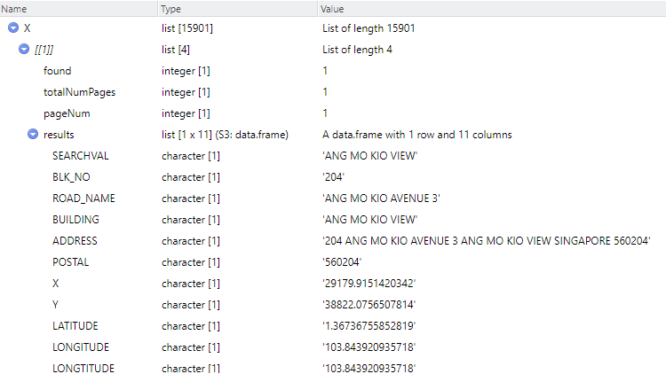
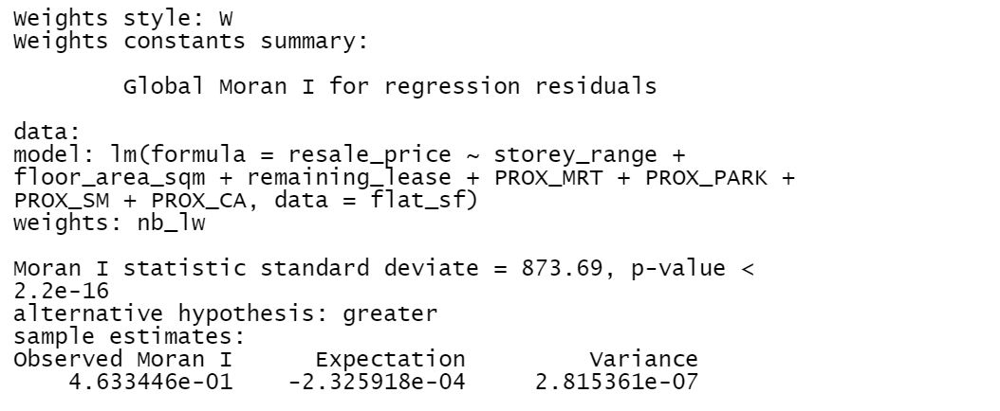
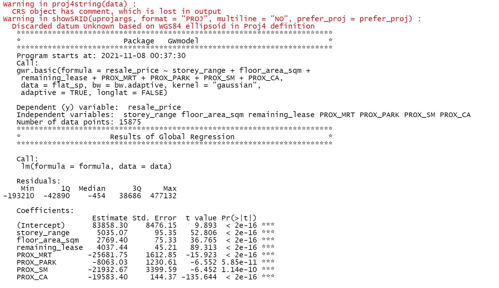
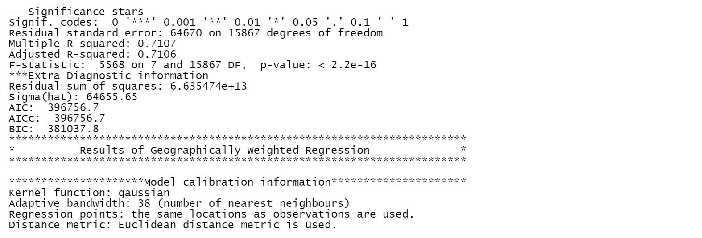
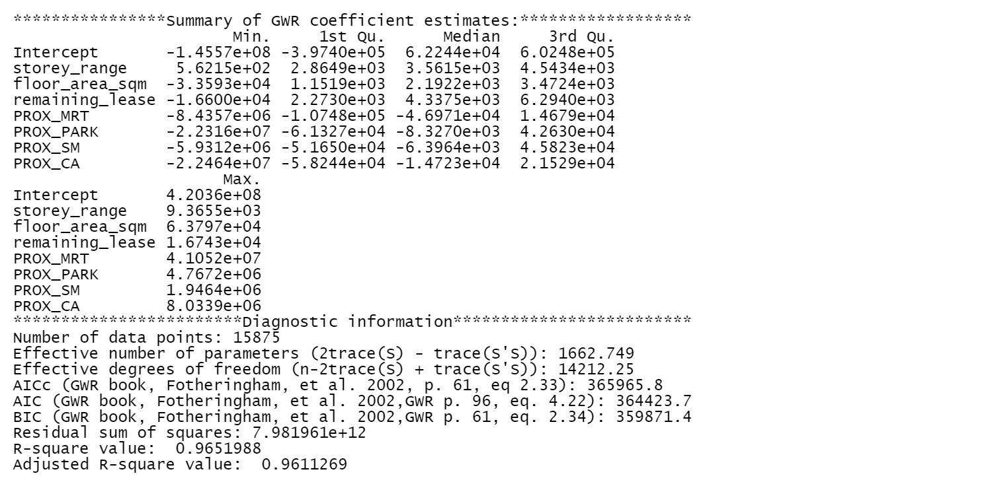

```{r setup, include=FALSE, cache = TRUE}
knitr::opts_chunk$set(echo = TRUE)
```

# AfterMath
Don't look at this assignment, not very good. should refer to these to do GWR.
* https://geniceee-is415-blog.netlify.app/posts/2021-11-05-take-home-exercise-3/
* https://is415-msty.netlify.app/posts/2021-10-25-take-home-exercise-3/#importing-geospatial-data
* https://aisyahajit2018-is415.netlify.app/posts/2021-11-07-take-home-exercise-3/?panelset13=code-chunk14#create-get_prox-function-to-calculate-proximity
* https://wlwong2018-is415-blog.netlify.app/posts/2021-11-06-take-home-exercise-3/#function-to-calculate-proximity-of-variables

# Note!
* For some code chunks, it takes a lot of time to load the outputs, in order for everything to run/knit/push smoothly, I have made some of them eval=FALSE and insert images of their outputs in this webpage. I’m also very sorry that I have disabled all the maps with “view” mode because my Netlify refused to load them.

# Data used
* Resale Flat Prices provided by [Data.gov.sg](https://data.gov.sg/dataset/resale-flat-prices). This study focuses on four-room flats with transaction period from 1st January 2019 to 30th September 2020.
* [URA Master Plan 2014’s planning subzone boundaries](https://data.gov.sg/dataset/master-plan-2014-subzone-boundary-web?resource_id=1c6b586b-61ca-45a9-b704-df4c9057fbd6). It is in ESRI shapefile format.
* MRT stations location from [data.gov.sg](https://data.gov.sg/dataset/master-plan-2019-rail-station-layer) (geojson)
* Parks location from [data.gov.sg](https://data.gov.sg/dataset/parks) (geojson)
* supermarkets location from [data.gov.sg](https://data.gov.sg/dataset/supermarkets) (geojson)

# 1. Install packages
```{r}
packages = c('olsrr', 'corrplot', "ggpubr", 'sf', "spdep", 'GWmodel', 'tmap', 'tidyverse', 'httr', 'jsonlite', 'data.table', 'geosphere')
for (p in packages){
  if(!require(p, character.only = T)){
    install.packages(p)
  }
  library(p,character.only = T)
}
```

* 12 R packages will be used for the following purposes:
  + sf, a relatively new R package specially designed to import, manage and process vector-based geospatial data in R.
  + tidyverse for performing data science tasks such as importing, wrangling and visualising attribute data.
  + spdep for computing spatial weights, global and local spatial autocorrelation statistics
  + tmap which provides functions for plotting static or interactive choropleth maps.
  + olsrr for building OLS and performing diagnostics tests
  + GWmodel for calibrating geographical weighted family of models
  + corrplot for multivariate data visualisation and analysis
  + ggpubr for organising graphs
  + httr for geting data from API
  + jsonlite for pasring JSON results
  + data.table for CJ() function which produces a data.table out of two vectors
  + geosphere for distHaversine() function which 'Haversine' great circle distance

# 2. Geospatial Data Wrangling
## a. import and transform data projection
```{r}
mpsz = st_read(dsn = "data/MP", layer = "MP14_SUBZONE_WEB_PL")

mpsz <- st_transform(mpsz, 3414)
st_crs(mpsz)

st_bbox(mpsz) #view extent
```

# 3. Aspatial Data Wrangling for resale flat data
## a. import data
```{r}
resale_flat = read_csv("data/resale-flat-prices/resale-flat-prices-based-on-registration-date-from-jan-2017-onwards.csv")
glimpse(resale_flat)
```

## b. filter data by date and by room type
```{r}
#transaction period from 1st January 2019 to 30th September 2020
#add dummy dates
resale_flat$date <- paste(resale_flat$month,"01",sep = "-")
#make the data type date
resale_flat$date <- as.Date(resale_flat$date, format= "%Y-%m-%d")
#filter data
resale_flat <- subset(resale_flat, date > "2018-12-31" & date < "2020-10-01")

#four-room flats
#filter data
resale_flat <- resale_flat[(resale_flat$flat_type == "4 ROOM"),]

#peek the dataframe
glimpse(resale_flat)
```

## c. Get longitude and latitude for flat address using OneMap API
#### 1) create address column
```{r}
resale_flat$address <- paste(resale_flat$block,resale_flat$street_name)
summary (resale_flat)

length(resale_flat[["address"]])
length(unique(resale_flat[["address"]]))
```

* There are duplicated addresses

#### 2) prepare api, get data and clean data
```{r eval=FALSE}
url <- "https://developers.onemap.sg/commonapi/search?"
getCOOR <- function(object) {
    raw_response <- httr::GET(url, 
                             query = list(searchVal = object, 
                                          returnGeom = "Y",
                                          getAddrDetails = "Y"))
    
    text_response <- content(raw_response, as = "text", encoding = "UTF-8")
    json_response <- jsonlite::fromJSON(text_response, flatten = TRUE)
}

#apply the function over the 'address' column in the dataframe
results <- lapply(resale_flat$address, getCOOR)
```

Now the results look like this:

I would like to subtract only the 'results' part of the results.

```{r eval=FALSE}
results <- lapply(results, `[[`, c('results'))
```

Now each list in the results list is a dataframe. Each dataframe is the api result corresponding to each row in the resale_flat 'address' colomun. In order to know which dataframe corresponding to which row, I would like to add the list index to each dataframe as a column. (Eg, results[[25]] should be a dataframe with column 'index' == 25 )

```{r eval=FALSE}
results <- Map(cbind, results, index = seq_along(results))
```

Now the results look like this, you can see the 'index' column has been added:

If the api did not respond properly, it will not return anything and the respective list will end up just with the index created just now.

I would like to see how many of these lists with length 1 are there in the results

```{r eval=FALSE}
null_result <- list()

for (e in results) {
  if (length(e)==1){
    null_result<- append(null_result, e)
  }
}
```

There are 26 of them:

I would like to remove these lists of integer from the results in order to bind the dataframes later properly

```{r eval=FALSE}
new_results <-list()
new_results <-results[lengths(results)>1]
```

Now, make the result a dataframe by using bind_rows() from dplyr package and save the resulted dataframe as a csv for later usage

```{r eval=FALSE}
df <- bind_rows(new_result)
write.csv(df,"api_results.csv", row.names = FALSE)
```

#### 3) combine api results into orginial resale_flat dataframe

```{r}
api = read_csv("api_results.csv")
head(api,20)
```

We can see there are some rows with the same index, such as index 14. This is because there may be more than 1 buildings with the same address and OneMap API will return both buildings for that particular address. Since we are not interested in the buildings for this study and only interested in the longitude and latitude of the address, I will delete duplicated rows using distinct() in the dplyr package and only leave one building for one address.

```{r}
new_api <- distinct(api, index, .keep_all = TRUE)
head(new_api,20)
```

I would like to create an id column for resale_flat dataframe to indicate its index so that we can bind the resale_flat and new_api dataframes with id==index.

```{r}
resale_flat$id <- seq.int(nrow(resale_flat))
head(resale_flat)
```

Match and join the two dataframes with id==index

```{r}
flat_coor <- left_join(resale_flat, new_api, by = c("id" = "index"))

head(flat_coor)
```

See through the dataframe, it is joined correctly.

#### 4) further data cleaning

Let's select only the meaningful columns and simplify the dataframe.

```{r}
flat_coor <- flat_coor[,c("id", "month","storey_range","floor_area_sqm","flat_model","lease_commence_date","remaining_lease","resale_price","address","LATITUDE","LONGITUDE")] 
```

There should be 26 addresses without any coordinates as api failed to return, drop them.

```{r}
which_nas <- apply(flat_coor, 1, function(X) any(is.na(X)))
length(which(which_nas))
which(which_nas)

flat_df <- flat_coor %>% drop_na()
```

# 4. Aspatial Data Wrangling for locational factors
## a. Proximity to MRT
#### a) import data
```{r}
MRT_sf <- st_read("data/locations/MRT/master-plan-2019-rail-station-layer-geojson.geojson")
```

#### b) get centroid coornidates of each multipolygon
```{r}
#get centroids
MRT_sf$centroids <- st_centroid(MRT_sf$geometry) %>% st_geometry()
#transform centroids
MRT_sf$centroids <- st_transform(MRT_sf$centroids, 4326)
#separate centroids into longitude and latitude and put into original dataframe
MRT_sf2 <- do.call(rbind, st_geometry(MRT_sf$centroids)) %>%
    as_tibble() %>%
    setNames(c("lon", "lat"))

MRT_sf$lon <- MRT_sf2$lon
MRT_sf$lat <- MRT_sf2$lat
```

#### c) get the distance between the nearest MRT coordinate for each flat address
```{r}
# create a dataframe for all flat and mrt locations pairs
flat_mrt <- CJ(flat_df$id, MRT_sf$Name)
names(flat_mrt) <- c("Flat", "MRT")

# create datatables for dataframes
flat_DT <- setDT(flat_df)
MRT_DT <- setDT(MRT_sf)

# add coordinates of flats
flat_mrt$flat_lat <- flat_DT$LATITUDE[match(flat_mrt$Flat, flat_DT$id)]
flat_mrt$flat_lon <- flat_DT$LONGITUDE[match(flat_mrt$Flat, flat_DT$id)]

# add coordinates of MRTs
flat_mrt$MRT_lat <- MRT_DT$lat[match(flat_mrt$MRT, MRT_DT$Name)]
flat_mrt$MRT_lon <- MRT_DT$lon[match(flat_mrt$MRT, MRT_DT$Name)]

# calculate distances
flat_mrt[, `:=`(dist, distHaversine(matrix(c(flat_lon, flat_lat), ncol = 2), matrix(c(MRT_lon, MRT_lat), ncol = 2)))]

# get the distance between the nearest MRT coordinate for each flat address
flat_mrt <- flat_mrt[, .(MRT = MRT[which.min(dist)], dist = min(dist)),
    by = Flat]

head(flat_mrt)
```

## b. Proximity to park
#### a) import data
```{r}
park_sf <- st_read("data/locations/parks/parks-geojson.geojson")
```

#### b) transform coordinates to lat long
```{r}
#transform geometry coordinates
park_sf$geometry <- st_transform(park_sf$geometry, 4326)
#separate geometry into longitude and latitude and put into original dataframe
park_sf2 <- do.call(rbind, st_geometry(park_sf$geometry)) %>%
    as_tibble() %>%
    setNames(c("lon", "lat"))

park_sf$lon <- park_sf2$lon
park_sf$lat <- park_sf2$lat
```

#### c) get the distance between the nearest Park coordinate for each flat address
```{r}
# create a dataframe for all flat and park locations pairs
flat_park <- CJ(flat_df$id, park_sf$Name)
names(flat_park) <- c("Flat", "park")

# create datatables for dataframes
flat_DT <- setDT(flat_df)
park_DT <- setDT(park_sf)

# add coordinates of flats
flat_park$flat_lat <- flat_DT$LATITUDE[match(flat_park$Flat, flat_DT$id)]
flat_park$flat_lon <- flat_DT$LONGITUDE[match(flat_park$Flat, flat_DT$id)]

# add coordinates of parks
flat_park$park_lat <- park_DT$lat[match(flat_park$park, park_DT$Name)]
flat_park$park_lon <- park_DT$lon[match(flat_park$park, park_DT$Name)]

# calculate distances
flat_park[, `:=`(dist, distHaversine(matrix(c(flat_lon, flat_lat), ncol = 2), matrix(c(park_lon, park_lat), ncol = 2)))]

# get the distance between the nearest park coordinate for each flat address
flat_park <- flat_park[, .(park = park[which.min(dist)], dist = min(dist)),
    by = Flat]

head(flat_park)
```

## c. Proximity to supermarket
#### a) import data
```{r}
SM_sf <- st_read("data/locations/supermarkets/supermarkets-geojson.geojson")
```

#### b) transform coordinates to lat long
```{r}
#transform geometry coordinates
SM_sf$geometry <- st_transform(SM_sf$geometry, 4326)
#separate geometry into longitude and latitude and put into original dataframe
SM_sf2 <- do.call(rbind, st_geometry(SM_sf$geometry)) %>%
    as_tibble() %>%
    setNames(c("lon", "lat"))

SM_sf$lon <- SM_sf2$lon
SM_sf$lat <- SM_sf2$lat
```

#### c) get the distance between the nearest supermarket coordinate for each flat address
```{r}
# create a dataframe for all flat and SM locations pairs
flat_SM <- CJ(flat_df$id, SM_sf$Name)
names(flat_SM) <- c("Flat", "SM")

# create datatables for dataframes
flat_DT <- setDT(flat_df)
SM_DT <- setDT(SM_sf)

# add coordinates of flats
flat_SM$flat_lat <- flat_DT$LATITUDE[match(flat_SM$Flat, flat_DT$id)]
flat_SM$flat_lon <- flat_DT$LONGITUDE[match(flat_SM$Flat, flat_DT$id)]

# add coordinates of SMs
flat_SM$SM_lat <- SM_DT$lat[match(flat_SM$SM, SM_DT$Name)]
flat_SM$SM_lon <- SM_DT$lon[match(flat_SM$SM, SM_DT$Name)]

# calculate distances
flat_SM[, `:=`(dist, distHaversine(matrix(c(flat_lon, flat_lat), ncol = 2), matrix(c(SM_lon, SM_lat), ncol = 2)))]

# get the distance between the nearest SM coordinate for each flat address
flat_SM <- flat_SM[, .(SM = SM[which.min(dist)], dist = min(dist)),
    by = Flat]

head(flat_SM)
```

## d. Proximity to Central Area of Singapore

According to [Wikipeida](https://en.wikipedia.org/wiki/Central_Area,_Singapore), the coordinates of Central Area of Singapore is 1°17′30″N 103°51′00″E, which is equal to 1.291667, 103.85 in decimal format according to [GeoHack](https://geohack.toolforge.org/geohack.php?pagename=Central_Area,_Singapore&params=1_17_30_N_103_51_00_E_type:city%2860520%29_region:SG).

#### a) create a dataframe
```{r}
Name <- c('Central Area')
lon <- as.numeric(c(103.85))
lat <- as.numeric(c(1.291667))

CA_sf <- data.frame(Name, lon, lat)
CA_sf
```

#### b) get the distance between Central Area and each flat address
```{r}
# create a dataframe for all flat and CA location pairs
flat_CA <- CJ(flat_df$id, CA_sf$Name)
names(flat_CA) <- c("Flat", "CA")

# create datatables for dataframes
flat_DT <- setDT(flat_df)
CA_DT <- setDT(CA_sf)

# add coordinates of flats
flat_CA$flat_lat <- flat_DT$LATITUDE[match(flat_CA$Flat, flat_DT$id)]
flat_CA$flat_lon <- flat_DT$LONGITUDE[match(flat_CA$Flat, flat_DT$id)]

# add coordinates of CAs
flat_CA$CA_lat <- CA_DT$lat[match(flat_CA$CA, CA_DT$Name)]
flat_CA$CA_lon <- CA_DT$lon[match(flat_CA$CA, CA_DT$Name)]

# calculate distances
flat_CA[, `:=`(dist, distHaversine(matrix(c(flat_lon, flat_lat), ncol = 2), matrix(c(CA_lon, CA_lat), ncol = 2)))]

# get the distance between the nearest CA coordinate for each flat address
flat_CA <- flat_CA[, .(CA = CA[which.min(dist)], dist = min(dist)),
    by = Flat]

head(flat_CA)
```

# 5. Combining all aspatial Data, adding location factors into flat_df
#### a) change unit from meter to km
```{r}
flat_mrt$dist <- (flat_mrt$dist/1000)
flat_park$dist <- (flat_park$dist/1000)
flat_SM$dist <- (flat_SM$dist/1000)
flat_CA$dist <- (flat_CA$dist/1000)
```

#### b) rename columns
```{r}
names(flat_mrt)[names(flat_mrt)=='dist'] <- 'PROX_MRT'
names(flat_park)[names(flat_park)=='dist'] <- 'PROX_PARK'
names(flat_SM)[names(flat_SM)=='dist'] <- 'PROX_SM'
names(flat_CA)[names(flat_CA)=='dist'] <- 'PROX_CA'
```

#### c) combine dataframes
```{r}
flat_df <- left_join(flat_df, flat_mrt, by = c('id' = 'Flat'))
flat_df <- left_join(flat_df, flat_park, by = c('id' = 'Flat'))
flat_df <- left_join(flat_df, flat_SM, by = c('id' = 'Flat'))
flat_df <- left_join(flat_df, flat_CA, by = c('id' = 'Flat'))

flat_df <- flat_df[,c("id", "month","storey_range","floor_area_sqm","flat_model","lease_commence_date","remaining_lease","resale_price","address","LATITUDE","LONGITUDE",'PROX_MRT','PROX_PARK','PROX_SM',"PROX_CA")] 
```

#### d) further cleaning
```{r}
# make storey_range to a number, take the lower one
flat_df$storey_range <- gsub(" .*$", "", flat_df$storey_range) %>%
    as.numeric()

# make remaining_lease to a number, take the year
flat_df$remaining_lease <- gsub(" .*$", "", flat_df$remaining_lease) %>%
    as.numeric()

glimpse(flat_df)
```

#### e) convert dataframe into a sf object
```{r}
flat_sf <- st_as_sf(flat_df,
                    coords = c("LONGITUDE", "LATITUDE"),
                    crs=4326) %>%
  st_transform(crs=3414)

head(flat_sf)
```

# 6. Exploratory Data Analysis (EDA)
## a. EDA using statistical graphics
```{r}
ggplot(data=flat_sf, aes(x=`resale_price`)) +
  geom_histogram(bins=20, color="black", fill="light blue")
```

* The figure above reveals a right skewed distribution. This means that more condominium units were transacted at relative lower prices.

#### normalize skewed dsitribution by using log transformation
```{r}
flat_sf <- flat_sf %>%
  mutate(`LOG_resale_price` = log(resale_price))
```

```{r}
ggplot(data=flat_sf, aes(x=`LOG_resale_price`)) +
  geom_histogram(bins=20, color="black", fill="light blue")
```

* Notice that the distribution is relatively less skewed after the transformation.

## b. Multiple Histogram Plots distribution of variables
```{r}
STOREY <- ggplot(data=flat_sf, aes(x= `storey_range`)) +
  geom_histogram(bins=20, color="black", fill="light blue")

AREA_SQM <- ggplot(data=flat_sf, aes(x= `floor_area_sqm`)) +
  geom_histogram(bins=20, color="black", fill="light blue")

REMAINING_LEASE <- ggplot(data=flat_sf, aes(x= `remaining_lease`)) +
  geom_histogram(bins=20, color="black", fill="light blue")

PROX_MRT <- ggplot(data=flat_sf, aes(x= `PROX_MRT`)) +
  geom_histogram(bins=20, color="black", fill="light blue")

PROX_PARK <- ggplot(data=flat_sf, aes(x= `PROX_PARK`)) +
  geom_histogram(bins=20, color="black", fill="light blue")

PROX_SM <- ggplot(data=flat_sf, aes(x= `PROX_SM`)) +
  geom_histogram(bins=20, color="black", fill="light blue")

PROX_CA <- ggplot(data=flat_sf, aes(x= `PROX_CA`)) +
  geom_histogram(bins=20, color="black", fill="light blue")

ggarrange(STOREY,AREA_SQM,REMAINING_LEASE,PROX_MRT,PROX_PARK,PROX_SM, PROX_CA, ncol = 3, nrow = 3)

```

## c. Drawing Statistical Point Map: reveal the geospatial distribution 4-room flat prices in Singapore
```{r}
# tmap_mode("view")

tm_shape(mpsz)+
  tm_polygons() +
tm_shape(flat_sf) +  
  tm_dots(col = "resale_price",
          alpha = 0.6,
          style="quantile")
#  tm_view(set.zoom.limits = c(11,14)) #set.zoom.limits argument of tm_view() sets the minimum and maximum zoom level to 11 and 14 respectively.

tmap_mode("plot")
```

# 7. Build hedonic pricing models for 4-room flat resale units
# 7a. Simple Linear Regression Method

* using resale_price as the dependent variable and floor_area_sqm as the independent variable

```{r}
flat.slr <- lm(formula=resale_price ~ floor_area_sqm, data = flat_sf)
```

* lm() returns an object of class “lm” or for multiple responses of class c(“mlm”, “lm”).

```{r}
summary(flat.slr)
```

* The output report reveals that the resale_price can be explained by using the formula: *y = 528807 - 1000.9(x)*
* The Adjusted R-squared of 0.003431 reveals that the simple regression model built is able to explain about 0.34% of the resale_price, which is pretty low. The negative coefficient of floor_area_sqm can also tell that this method is bad at explaining the resale_price as it is counter-intuitive to say the bigger the floor_area_sqm, the lower the resale_price. All these will lead us to use other models to explain the resale_price later.
* Since p-value is much smaller than 0.0001, we will reject the null hypothesis that mean is a good estimator of resale_price. This will allow us to infer that simple linear regression model above is a good estimator of resale_price.
* The Coefficients: section of the report reveals that the p-values of both the estimates of the Intercept and floor_area_sqm are smaller than 0.001. In view of this, the null hypothesis of the B0 and B1 are equal to 0 will be rejected. As a results, we will be able to infer that the B0 and B1 are good parameter estimates.

#### To visualise the best fit curve on a scatterplot
```{r}
ggplot(data=flat.slr,  
       aes(x=`floor_area_sqm`, y=`resale_price`)) +
  geom_point() +
  geom_smooth(method = lm)
```

# 7b. Multiple Linear Regression Method
## a. Visualising the relationships of the independent variables/Checking multicollinearity of the model
```{r}
flat_df2 <- flat_df[,c("id","resale_price","storey_range","floor_area_sqm","remaining_lease",'PROX_MRT','PROX_PARK','PROX_SM',"PROX_CA")] 


corrplot(cor(flat_df2[, 3:9]), diag = FALSE, order = "AOE",
         tl.pos = "td", tl.cex = 0.5, method = "number", type = "upper")
```

* Matrix reorder is very important for mining the hiden structure and patter in the matrix. There are four methods in corrplot (parameter order), named “AOE”, “FPC”, “hclust”, “alphabet”. In the code chunk above, AOE order is used. It orders the variables by using the angular order of the eigenvectors method suggested by Michael Friendly.
* From the scatterplot matrix, there is no independent variable highly related to each other. Thus we will include all independent variables in the subsequent model building.

## b. Building a hedonic pricing model using multiple linear regression method
```{r}
flat.mlr <- lm(formula = resale_price ~ storey_range + floor_area_sqm  + remaining_lease + PROX_MRT + PROX_PARK + PROX_SM + PROX_CA, data=flat_sf)

summary(flat.mlr)
```
* The output report reveals that the resale_price can be explained by using the formula: y = 83858.30 + 5035.07(storey_range) + 2769.40(floor_area_sqm) + 4037.44(remaining_lease) - 25681.75(PROX_MRT) - 8063.03(PROX_PARK) - 21932.67(PROX_SM) - 19583.40(PROX_CA)
* The Adjusted R-squared of 0.7106 reveals that the multi-linear regression model built is able to explain about 71% of the resale_price, which is much higher than simple linear regression model.
* Since p-value is much smaller than 0.0001, it can be inferred that multi-linear regression model above is a good estimator of resale_price.
* The Coefficients: section of the report reveals that the p-values of both the estimates of the Intercept and independent variables are smaller than 0.001. Thus all the independent variables are statistically significant and we will keep them all. All these independent variables are good parameter estimates.

## c. Checking for multicolinearity
```{r}
ols_vif_tol(flat.mlr)
```

* Since the VIF of the independent variables are less than 10. We can safely conclude that there are no sign of multicollinearity among the independent variables.

## d. Test for Non-Linearity
```{r}
ols_plot_resid_fit(flat.mlr)
```

* The figure above reveals that most of the data points are scattered around the 0 line, hence we can safely conclude that the relationships between the dependent variable and independent variables are linear.

## e. Test for Normality Assumption
```{r}
ols_plot_resid_hist(flat.mlr)
```

* The figure reveals that the residual of the multiple linear regression model (i.e. flat.mlr) resembles normal distribution.

## f. Testing for Spatial Autocorrelation

* The hedonic model we try to build are using geographically referenced attributes, hence it is also important for us to visual the residual of the hedonic pricing model.

#### export the residual of the hedonic pricing model and save it as a data frame
```{r}
mlr.output <- as.data.frame(flat.mlr$residuals)
```

#### join the newly created data frame with flat_sf object
```{r}
flat_res_sf <- cbind(flat_sf,
                     flat.mlr$residuals) %>%
rename(`MLR_RES` = `flat.mlr.residuals`)
```

#### convert flat_res_sf simple feature object into a SpatialPointsDataFrame because spdep package can only process sp conformed spatial data objects in order to perform spatial autocorrelation test
```{r}
flat_sp <- as_Spatial(flat_res_sf)
flat_sp
```

#### display the distribution of the residuals on an interactive map.
```{r}
#tmap_mode("view")

tm_shape(mpsz)+
  tm_polygons(alpha = 0.4) +
tm_shape(flat_res_sf) +  
  tm_dots(col = "MLR_RES",
          alpha = 0.6,
          style="quantile") 
#  tm_view(set.zoom.limits = c(11,14))

tmap_mode("plot")
```

* The figure above reveal that there is a sign of spatial autocorrelation as there seems to be colour clusters.

#### Moran’s I test: to prove there is a sign of spatial autocorrelation

```{r eval=FALSE}
# compute the distance-based weight matrix
nb <- dnearneigh(coordinates(flat_sp), 0, 1500, longlat = FALSE)
summary(nb)

# convert the output neighbours lists (i.e. nb) into a spatial weights
nb_lw <- nb2listw(nb, style = 'W')
summary(nb_lw)

# perform Moran’s I test for residual spatial autocorrelation
lm.morantest(flat.mlr, nb_lw)
```



* The Global Moran’s I test for residual spatial autocorrelation shows that it’s p-value is much less than the alpha value of 0.05. Hence, we will reject the null hypothesis that the residuals are randomly distributed.
* Since the Observed Global Moran I = 0.4633446 which is greater than 0, we can infer than the residuals resemble cluster distribution.
* All these will lead us into considering Geographical Weighted Regression model to explain the resale_price better.

# 8. Building Hedonic Pricing Models using GWmodel
## a. Building Fixed Bandwidth GWR Model
#### Computing fixed bandwith
```{r eval=FALSE}
bw.fixed <- bw.gwr(formula = resale_price ~ storey_range + floor_area_sqm  + remaining_lease + PROX_MRT + PROX_PARK + PROX_SM + PROX_CA, data=flat_sp, approach="CV", kernel="gaussian", adaptive=FALSE, longlat=FALSE)
```


* There are two possible approaches can be used to determine the stopping rule, they are: least CV cross-validation approach and least AIC corrected approach. We define the stopping rule using approach argument.
* The result shows that the recommended bandwidth is 286.0551 meters with least CV score 9.543952e+12. 

#### GWModel method - fixed bandwith
```{r eval=FALSE}
gwr.fixed <- gwr.basic(formula = resale_price ~ storey_range + floor_area_sqm  + remaining_lease + PROX_MRT + PROX_PARK + PROX_SM + PROX_CA, data=flat_sp, bw=bw.fixed, kernel = 'gaussian', longlat = FALSE)

gwr.fixed
```


* The report shows that the adjusted r-square of the gwr is 0.9637 which is significantly better than the global multiple linear regression model of 0.7106.

## b. Building Adaptive Bandwidth GWR Model
#### Computing the adaptive bandwidth
```{r eval=FALSE}
bw.adaptive <- bw.gwr(formula = resale_price ~ storey_range + floor_area_sqm  + remaining_lease + PROX_MRT + PROX_PARK + PROX_SM + PROX_CA, data=flat_sp, approach="CV", kernel="gaussian", adaptive=TRUE, longlat=FALSE)
```


* The result shows that the 38 is the recommended data points to be used with least CV score.

#### Constructing the adaptive bandwidth gwr model
```{r eval=FALSE}
gwr.adaptive <- gwr.basic(formula = resale_price ~ storey_range + floor_area_sqm  + remaining_lease + PROX_MRT + PROX_PARK + PROX_SM + PROX_CA, data=flat_sp, bw=bw.adaptive, kernel = 'gaussian', adaptive=TRUE, longlat = FALSE)

gwr.adaptive
```







* The report shows that the adjusted r-square of the gwr is 0.9611 which is significantly better than the global multiple linear regression model of 0.7106.

* Since the adjusted r-square of the gwr for fixed bandwidth is higher adaptive bandwidth, we will use the gwr for fixed bandwidth for further analysis.

# 9. Visualising GWR Output

* In addition to regression residuals, the output feature class table includes fields for observed and predicted y values, condition number (cond), Local R2, residuals, and explanatory variable coefficients and standard errors:
  + Condition Number: this diagnostic evaluates local collinearity. In the presence of strong local collinearity, results become unstable. Results associated with condition numbers larger than 30, may be unreliable.
  + Local R2: these values range between 0.0 and 1.0 and indicate how well the local regression model fits observed y values. Very low values indicate the local model is performing poorly. Mapping the Local R2 values to see where GWR predicts well and where it predicts poorly may provide clues about important variables that may be missing from the regression model.
  + Predicted: these are the estimated (or fitted) y values 3. computed by GWR.
  + Residuals: to obtain the residual values, the fitted y values are subtracted from the observed y values. Standardized residuals have a mean of zero and a standard deviation of 1. A cold-to-hot rendered map of standardized residuals can be produce by using these values.
  + Coefficient Standard Error: these values measure the reliability of each coefficient estimate. Confidence in those estimates are higher when standard errors are small in relation to the actual coefficient values. Large standard errors may indicate problems with local collinearity.
* They are all stored in a SpatialPointsDataFrame or SpatialPolygonsDataFrame object integrated with fit.points, GWR coefficient estimates, y value, predicted values, coefficient standard errors and t-values in its “data” slot in an object called SDF of the output list.

## a. Converting SDF into sf data.frame

```{r eval=FALSE}
flat_sf.fixed <- st_as_sf(gwr.fixed$SDF) %>%
  st_transform(crs=3414)

flat_sf.fixed.svy21 <- st_transform(flat_sf.fixed, 3414)
flat_sf.fixed.svy21  
```


```{r eval=FALSE}
gwr.fixed.output <- as.data.frame(gwr.fixed$SDF)
flat_sf.fixed <- cbind(flat_res_sf, as.matrix(gwr.fixed.output))

glimpse(flat_sf.fixed)
```


```{r eval=FALSE}
summary(gwr.fixed$SDF$yhat)
```


## b. Visualising local R2
```{r eval=FALSE}
tmap_mode("view")
tm_shape(mpsz)+
  tm_polygons(alpha = 0.1) +
tm_shape(flat_sf.fixed) +  
  tm_dots(col = "Local_R2",
          border.col = "gray60",
          border.lwd = 1) +
  tm_view(set.zoom.limits = c(11,14))

tmap_mode("plot")
```


#### By URA Plannign Region
```{r}
unique(mpsz$REGION_N)
```

```{r eval=FALSE}
CR <- tm_shape(mpsz[mpsz$REGION_N=="CENTRAL REGION", ])+
        tm_polygons()+
      tm_shape(flat_sf.fixed) + 
        tm_bubbles(col = "Local_R2",
                   size = 0.15,
                   border.col = "gray60",
                   border.lwd = 1)

WR <- tm_shape(mpsz[mpsz$REGION_N=="WEST REGION", ])+
        tm_polygons()+
      tm_shape(flat_sf.fixed) + 
        tm_bubbles(col = "Local_R2",
                   size = 0.15,
                   border.col = "gray60",
                   border.lwd = 1)

ER <- tm_shape(mpsz[mpsz$REGION_N=="EAST REGION", ])+
        tm_polygons()+
      tm_shape(flat_sf.fixed) + 
        tm_bubbles(col = "Local_R2",
                   size = 0.15,
                   border.col = "gray60",
                   border.lwd = 1)

NER <- tm_shape(mpsz[mpsz$REGION_N=="NORTH-EAST REGION", ])+
        tm_polygons()+
       tm_shape(flat_sf.fixed) + 
        tm_bubbles(col = "Local_R2",
                   size = 0.15,
                   border.col = "gray60",
                   border.lwd = 1)

NR <- tm_shape(mpsz[mpsz$REGION_N=="NORTH REGION", ])+
        tm_polygons()+
      tm_shape(flat_sf.fixed) + 
        tm_bubbles(col = "Local_R2",
                   size = 0.15,
                   border.col = "gray60",
                   border.lwd = 1)

tmap_arrange(CR, WR, ER, NER, NR, ncol=2, nrow=3)
```


* From all these maps we can see how well the local regression model fits observed y values. Most of the values are nearer to 1 indicates the local model is performing very well. In all regions the GWR predicts well. If to really tell the differences, the GWR in CENTRAL REGION, WEST REGION and NORTH REGION performs better than the GWR in EAST REGION and NORTH-EAST REGION as there seem to be very little flat locations with value nearer to 0. For EAST REGION and NORTH-EAST REGION the flat locations with value nearer to 0 seems resembles clusters, that means there may be important variables that may be missing from the regression model.


