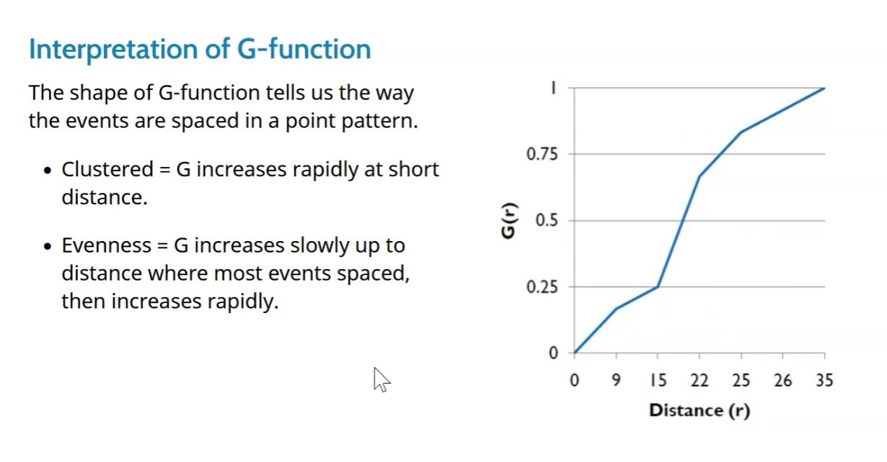
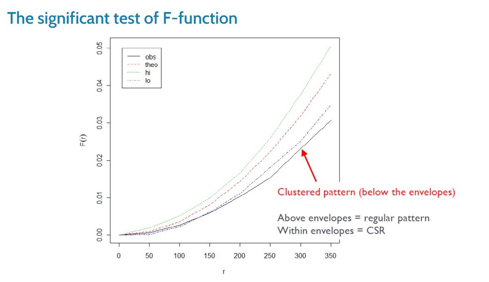

```{r setup, include=FALSE, cache = TRUE}
knitr::opts_chunk$set(echo = TRUE)
```

# Goal
* Conduct Spatial Point Patterns Analysis to Uncover whether McDonald's outlets in Singapore are distributed randomly and if not, what are the factors that affect the outlets’ location

* factors:
  + KFCs
  + Community Clubs
  + Gyms
  + MRT

* Kernel Density Estimation
  + Visualise and explore the intensity of points
* G-Function and F-Function
  + Reveal whether points resemble clustered pattern, regular pattern or are distributed randomly
* Cross L-Function (Cross K-fuction)
  + Uncover whether target point locations are dependent on other points’ locations
  
# 1. Install packages

```{r}
packages = c('maptools', 'olsrr', 'corrplot', "ggpubr", 'sf', "spdep", 'GWmodel', 'tmap', 'tidyverse', 'httr', 'jsonlite', 'data.table', 'geosphere', 'raster', 'spatstat')
for (p in packages){
  if(!require(p, character.only = T)){
    install.packages(p)
  }
  library(p,character.only = T)
}
```

# 2. Prepare data (not important)
## MC
```{r eval=FALSE}
mc = read_csv("data/MC.csv")
glimpse(mc)
```

```{r eval=FALSE}
url <- "https://developers.onemap.sg/commonapi/search?"
getCOOR <- function(object) {
    raw_response <- httr::GET(url, 
                             query = list(searchVal = object, 
                                          returnGeom = "Y",
                                          getAddrDetails = "Y"))
    
    text_response <- content(raw_response, as = "text", encoding = "UTF-8")
    json_response <- jsonlite::fromJSON(text_response, flatten = TRUE)
}

results <- lapply(mc$Postcode, getCOOR)
```

```{r eval=FALSE}
results <- lapply(results, `[[`, c('results'))

new_results <-list()
new_results <-results[lengths(results)>1]

mc_df <- bind_rows(new_results)

mc_df <- distinct(mc_df, POSTAL, .keep_all = TRUE)
head(mc_df,20)
```

```{r eval=FALSE}
mc_prepared <- left_join(mc, mc_df, by = c("Postcode" = "POSTAL"))

head(mc_prepared)
```

```{r eval=FALSE}
mc_prepared <- mc_prepared[,c("Name", "Postcode","LATITUDE","LONGITUDE")] 
```

```{r eval=FALSE}
which_nas <- apply(mc_prepared, 1, function(X) any(is.na(X)))
length(which(which_nas))
which(which_nas)

mc_prepared <- mc_prepared %>% drop_na()
```

```{r eval=FALSE}
write.csv(mc_prepared,"mc_prepared.csv", row.names = FALSE)
```

## KFC
```{r eval=FALSE}
kfc = read_csv("data/KFC.csv")
glimpse(kfc)
```

```{r eval=FALSE}
url <- "https://developers.onemap.sg/commonapi/search?"
getCOOR <- function(object) {
    raw_response <- httr::GET(url, 
                             query = list(searchVal = object, 
                                          returnGeom = "Y",
                                          getAddrDetails = "Y"))
    
    text_response <- content(raw_response, as = "text", encoding = "UTF-8")
    json_response <- jsonlite::fromJSON(text_response, flatten = TRUE)
}

results <- lapply(kfc$Postcode, getCOOR)
```

```{r eval=FALSE}
results <- lapply(results, `[[`, c('results'))

new_results <-list()
new_results <-results[lengths(results)>1]

kfc_df <- bind_rows(new_results)

kfc_df <- distinct(kfc_df, POSTAL, .keep_all = TRUE)
head(kfc_df,20)
```

```{r eval=FALSE}
kfc_prepared <- left_join(kfc, kfc_df, by = c("Postcode" = "POSTAL"))

head(kfc_prepared)
```

```{r eval=FALSE}
kfc_prepared <- kfc_prepared[,c("Name", "Postcode","LATITUDE","LONGITUDE")] 
```

```{r eval=FALSE}
which_nas <- apply(kfc_prepared, 1, function(X) any(is.na(X)))
length(which(which_nas))
which(which_nas)

kfc_prepared <- kfc_prepared %>% drop_na()
```

```{r eval=FALSE}
write.csv(kfc_prepared,"kfc_prepared.csv", row.names = FALSE)
```

## MRT
```{r eval=FALSE}
MRT_sf <- st_read("data/MRT/master-plan-2019-rail-station-layer-geojson.geojson")
```

```{r eval=FALSE}
#get centroids
MRT_sf$centroids <- st_centroid(MRT_sf$geometry) %>% st_geometry()
#transform centroids
MRT_sf$centroids <- st_transform(MRT_sf$centroids, 4326)
#separate centroids into longitude and latitude and put into original dataframe
MRT_sf2 <- do.call(rbind, st_geometry(MRT_sf$centroids)) %>%
    as_tibble() %>%
    setNames(c("lon", "lat"))

MRT_sf$LONGITUDE <- MRT_sf2$lon
MRT_sf$LATITUDE <- MRT_sf2$lat
```

```{r eval=FALSE}
MRT_sf <- MRT_sf[,c("Name", "LATITUDE","LONGITUDE")] 
st_geometry(MRT_sf) <- NULL
```

```{r eval=FALSE}
write.csv(MRT_sf,"MRT_prepared.csv", row.names = FALSE)
```

# 3. Import and transform data

```{r}
sg_sf <- st_read(dsn = "data/sg", layer="CostalOutline")

kfc <- read_csv("data/kfc_prepared.csv")
mrt <- read_csv("data/MRT_prepared.csv")
mc <- read_csv("data/mc_prepared.csv")

gym_sf <- st_read("data/gym/gyms-sg-geojson.geojson") %>%
  st_transform(crs = 3414)

cc_sf <- st_read("data/CC/community-clubs-geojson.geojson") %>%
  st_transform(crs = 3414)
```

```{r}
sg_sf <- st_set_crs(sg_sf, 3414)

kfc_sf <- st_as_sf(kfc,
                   coords = c("LONGITUDE", "LATITUDE"),
                   crs=4326) %>%
  st_transform(crs = 3414)

mrt_sf <- st_as_sf(mrt, 
                       coords = c("LONGITUDE", "LATITUDE"),
                       crs=4326) %>%
  st_transform(crs = 3414)

mc_sf <- st_as_sf(mc, 
                       coords = c("LONGITUDE", "LATITUDE"),
                       crs=4326) %>%
  st_transform(crs = 3414)
```

```{r}
st_crs(kfc_sf)
st_crs(mrt_sf)
st_crs(mc_sf)
st_crs(gym_sf)
st_crs(cc_sf)
st_crs(sg_sf)
```

## Have a glance at the point maps
```{r}
tm_shape(sg_sf) +
  tm_polygons() +
tm_shape(kfc_sf) +
  tm_dots(alpha=0.4,
          col="blue",
          size=0.05)

tm_shape(sg_sf) +
  tm_polygons() +
tm_shape(mrt_sf) +
  tm_dots(alpha=0.4,
          col="red",
          size=0.05)

tm_shape(sg_sf) +
  tm_polygons() +
tm_shape(mc_sf) +
  tm_dots(alpha=0.4,
          col="red",
          size=0.05)

tm_shape(sg_sf) +
  tm_polygons() +
tm_shape(gym_sf) +
  tm_dots(alpha=0.4,
          col="red",
          size=0.05) 

tm_shape(sg_sf) +
  tm_polygons() +
tm_shape(cc_sf) +
  tm_dots(alpha=0.4,
          col="red",
          size=0.05) +


tmap_mode("plot")
```

# 4. Geospatial data wrangling

## a. Converting sf data frames to Spatial class
```{r}
kfc <- as_Spatial(kfc_sf)
mrt <- as_Spatial(mrt_sf)
mc <- as_Spatial(mc_sf)
gym <- as_Spatial(gym_sf)
cc <- as_Spatial(cc_sf)
sg <- as_Spatial(st_zm(sg_sf))
```

## b. Converting the Spatial class into generic sp object
```{r}
kfc_sp <- as(kfc, "SpatialPoints")
mrt_sp <- as(mrt, "SpatialPoints")
mc_sp <- as(mc, "SpatialPoints")
gym_sp <- as(gym, "SpatialPoints")
cc_sp <- as(cc, "SpatialPoints")
sg_sp <- as(sg, "SpatialPolygons")
```

## c. Converting the generic sp object into spatstat’s ppp object

* spatstat requires the analytical data in ppp object form

```{r}
kfc_ppp <- as(kfc_sp, "ppp")
mrt_ppp <- as(mrt_sp, "ppp")
mc_ppp <- as(mc_sp, "ppp")
gym_ppp <- as(gym_sp, "ppp")
cc_ppp <- as(cc_sp, "ppp")
```

```{r}
summary(kfc_ppp)
summary(mrt_ppp)
summary(mc_ppp)
summary(gym_ppp)
summary(cc_ppp)
```

## d. Handling duplicate points

* To handle duplicate: jittering, which will add a small perturbation to the duplicate points so that they do not occupy the exact same space.

```{r}
kfc_ppp_jit <- rjitter(kfc_ppp, 
                             retry=TRUE, 
                             nsim=1, 
                             drop=TRUE)

any(duplicated(kfc_ppp_jit))

mrt_ppp_jit <- rjitter(mrt_ppp, 
                             retry=TRUE, 
                             nsim=1, 
                             drop=TRUE)

any(duplicated(mrt_ppp_jit))

mc_ppp_jit <- rjitter(mc_ppp, 
                             retry=TRUE, 
                             nsim=1, 
                             drop=TRUE)

any(duplicated(mc_ppp_jit))

gym_ppp_jit <- rjitter(gym_ppp, 
                             retry=TRUE, 
                             nsim=1, 
                             drop=TRUE)

any(duplicated(gym_ppp_jit))

cc_ppp_jit <- rjitter(cc_ppp, 
                             retry=TRUE, 
                             nsim=1, 
                             drop=TRUE)

any(duplicated(cc_ppp_jit))
```

## e. Creating owin object

* When analysing spatial point patterns, it is a good practice to confine the analysis with a geographical area like Singapore boundary. In spatstat, an object called owin is specially designed to represent this polygonal region.

#### covert sg spatialpolygon object into owin object of spatstat
```{r}
sg_owin <- as(sg_sp, "owin")
plot(sg_owin)
```

## f. Combining point events object and owin object
```{r}
kfcSG_ppp = kfc_ppp_jit[sg_owin]
mrtSG_ppp = mrt_ppp_jit[sg_owin]
mcSG_ppp = mc_ppp_jit[sg_owin]
gymSG_ppp = gym_ppp_jit[sg_owin]
ccSG_ppp = cc_ppp_jit[sg_owin]
```

```{r}
par(mar=c(1,1,1,1))
plot(kfcSG_ppp)
plot(mrtSG_ppp)
plot(mcSG_ppp)
plot(gymSG_ppp)
plot(ccSG_ppp)
```

# 5. First-order Spatial Point Patterns Analysis: deriving kernel density estimation (KDE) layer for visualising and exploring the intensity of point processes

## a. Computing kernel density estimation using automatic bandwidth selection method
#### Using sigma = bw.diggle
```{r, warning = FALSE}
# Rescale KDE values: covert the unit of measurement from meter to kilometer.
kfcSG_ppp.km <- rescale(kfcSG_ppp, 1000, "km")
#plot
kde_kfcSG_bw <- density(kfcSG_ppp.km,
                              sigma=bw.diggle,
                              edge=TRUE,
                            kernel="gaussian") 

# Rescale KDE values: covert the unit of measurement from meter to kilometer.
mrtSG_ppp.km <- rescale(mrtSG_ppp, 1000, "km")
#plot
kde_mrtSG_bw <- density(mrtSG_ppp.km,
                              sigma=bw.diggle,
                              edge=TRUE,
                            kernel="gaussian") 

# Rescale KDE values: covert the unit of measurement from meter to kilometer.
mcSG_ppp.km <- rescale(mcSG_ppp, 1000, "km")
#plot
kde_mcSG_bw <- density(mcSG_ppp.km,
                              sigma=bw.diggle,
                              edge=TRUE,
                            kernel="gaussian") 

# Rescale KDE values: covert the unit of measurement from meter to kilometer.
gymSG_ppp.km <- rescale(gymSG_ppp, 1000, "km")
#plot
kde_gymSG_bw <- density(gymSG_ppp.km,
                              sigma=bw.diggle,
                              edge=TRUE,
                            kernel="gaussian")

# Rescale KDE values: covert the unit of measurement from meter to kilometer.
ccSG_ppp.km <- rescale(ccSG_ppp, 1000, "km")
#plot
kde_ccSG_bw <- density(ccSG_ppp.km,
                              sigma=bw.diggle,
                              edge=TRUE,
                            kernel="gaussian")
```

#### Using sigma = bw.ppl
```{r, warning = FALSE}
kde_kfcSG_ppl <- density(kfcSG_ppp.km,
                              sigma=bw.ppl,
                              edge=TRUE,
                            kernel="gaussian") 

kde_mrtSG_ppl <- density(mrtSG_ppp.km,
                              sigma=bw.ppl,
                              edge=TRUE,
                            kernel="gaussian") 

kde_mcSG_ppl <- density(mcSG_ppp.km,
                              sigma=bw.ppl,
                              edge=TRUE,
                            kernel="gaussian") 

kde_gymSG_ppl <- density(gymSG_ppp.km,
                              sigma=bw.ppl,
                              edge=TRUE,
                            kernel="gaussian")

kde_ccSG_ppl <- density(ccSG_ppp.km,
                              sigma=bw.ppl,
                              edge=TRUE,
                            kernel="gaussian")
```

#### Let's try to look at the bandwidths returned by these two methods first
```{r, warning = FALSE}
#let's see some examples
bw.diggle(kfcSG_ppp.km)
bw.ppl(kfcSG_ppp.km)

bw.diggle(mrtSG_ppp.km)
bw.ppl(mrtSG_ppp.km)

bw.diggle(mcSG_ppp.km)
bw.ppl(mcSG_ppp.km)

bw.diggle(gymSG_ppp.km)
bw.ppl(gymSG_ppp.km)

bw.diggle(ccSG_ppp.km)
bw.ppl(ccSG_ppp.km)
```

* We can see for all Diggle algorithm gives narrower bandwiths.

#### plot and compare bw.diggle and bw.ppl
```{r, warning = FALSE}
par(mar=c(1,1,1,1))
plot(kde_kfcSG_bw, main = "kfcSG diggle")
plot(kde_kfcSG_ppl, main = "kfcSG ppl")
plot(kde_mrtSG_bw, main = "mrtSG diggle")
plot(kde_mrtSG_ppl, main = "mrtSG ppl")
plot(kde_mcSG_bw, main = "mcSG diggle")
plot(kde_mcSG_ppl, main = "mcSG ppl")
plot(kde_gymSG_bw, main = "gymSG diggle")
plot(kde_gymSG_ppl, main = "gymSG ppl")
plot(kde_ccSG_bw, main = "ccSG diggle")
plot(kde_ccSG_ppl, main = "ccSG ppl")
```

* For graphs consist predominantly of tight clusters, bw.ppl produce the more appropriate values; for graphs that consist lots of spreading points, bw.diggle is good at detecting at/emphasizing on clusters among those points -- Baddeley's (2016) observation.

## b. Computing kernel density estimation using fixed/adaptive bandwidth method
#### using fixed bandwidth
```{r, warning = FALSE}
#compute a KDE layer by defining a bandwidth of 1000 meter. Notice the sigma value used is 1. This is because the unit of measurement of mcSG_ppp.km object is in kilometer, hence the 1000m is 1km.

kde_kfcSG_bw_1 <- density(kfcSG_ppp.km,
                              sigma=1,
                              edge=TRUE,
                            kernel="gaussian") 

kde_mrtSG_bw_1 <- density(mrtSG_ppp.km,
                              sigma=1,
                              edge=TRUE,
                            kernel="gaussian") 

kde_mcSG_bw_1 <- density(mcSG_ppp.km,
                              sigma=1,
                              edge=TRUE,
                            kernel="gaussian") 

kde_gymSG_bw_1 <- density(gymSG_ppp.km,
                              sigma=1,
                              edge=TRUE,
                            kernel="gaussian")

kde_ccSG_bw_1 <- density(ccSG_ppp.km,
                              sigma=1,
                              edge=TRUE,
                            kernel="gaussian")
```

#### using adaptive bandwidth
```{r, warning = FALSE}
kde_kfcSG_adaptive <- adaptive.density(kfcSG_ppp.km, method="kernel")

kde_mrtSG_adaptive <- adaptive.density(mrtSG_ppp.km, method="kernel")

kde_mcSG_adaptive <- adaptive.density(mcSG_ppp.km, method="kernel")

kde_gymSG_adaptive <- adaptive.density(gymSG_ppp.km, method="kernel")

kde_ccSG_adaptive <- adaptive.density(ccSG_ppp.km, method="kernel")
```

#### plot and compare fixed and adaptive bandwidth
```{r, warning = FALSE}
par(mar=c(1,1,1,1))
plot(kde_kfcSG_bw_1, main = "kfcSG fixed")
plot(kde_kfcSG_adaptive, main = "kfcSG adaptive")
plot(kde_mrtSG_bw_1, main = "mrtSG fixed")
plot(kde_mrtSG_adaptive, main = "mrtSG adaptive")
plot(kde_mcSG_bw_1, main = "mcSG fixed")
plot(kde_mcSG_adaptive, main = "mcSG adaptive")
plot(kde_gymSG_bw_1, main = "gymSG fixed")
plot(kde_gymSG_adaptive, main = "gymSG adaptive")
plot(kde_ccSG_bw_1, main = "ccSG fixed")
plot(kde_ccSG_adaptive, main = "ccSG adaptive")
```

## c. Convert KDE output into raster and display the kernel density maps on openstreetmap of Singapore
```{r, warning=FALSE}
# convert KDE output into grid
gridded_kde_kfcSG_bw <- as.SpatialGridDataFrame.im(kde_kfcSG_bw)
gridded_kde_mrtSG_bw <- as.SpatialGridDataFrame.im(kde_mrtSG_bw)
gridded_kde_mcSG_bw <- as.SpatialGridDataFrame.im(kde_mcSG_bw)
gridded_kde_gymSG_bw <- as.SpatialGridDataFrame.im(kde_gymSG_bw)
gridded_kde_ccSG_bw <- as.SpatialGridDataFrame.im(kde_ccSG_bw)

# convert gridded output into raster
kde_kfcSG_bw_raster <- raster(gridded_kde_kfcSG_bw)
kde_mrtSG_bw_raster <- raster(gridded_kde_mrtSG_bw)
kde_mcSG_bw_raster <- raster(gridded_kde_mcSG_bw)
kde_gymSG_bw_raster <- raster(gridded_kde_gymSG_bw)
kde_ccSG_bw_raster <- raster(gridded_kde_ccSG_bw)

# assign projection system to raster
projection(kde_kfcSG_bw_raster) <- CRS("+init=EPSG:3414 +datum=WGS84 +units=km")
projection(kde_mrtSG_bw_raster) <- CRS("+init=EPSG:3414 +datum=WGS84 +units=km")
projection(kde_mcSG_bw_raster) <- CRS("+init=EPSG:3414 +datum=WGS84 +units=km")
projection(kde_gymSG_bw_raster) <- CRS("+init=EPSG:3414 +datum=WGS84 +units=km")
projection(kde_ccSG_bw_raster) <- CRS("+init=EPSG:3414 +datum=WGS84 +units=km")

# visualise the raster kernel density maps on openstreetmap of Singapore
#tmap_mode("view")
tmap_options(check.and.fix = TRUE)

kfcSG_osmap <- tm_shape(sg_sf) +
  tm_borders(col = 'black',
             lwd = 1,
             alpha = 0.5) +
  tm_shape(kde_kfcSG_bw_raster) + 
  tm_raster("v", alpha = 0.7) +
  tm_layout(legend.outside = TRUE, frame = FALSE, title = "kfcSG") +
  tm_basemap('OpenStreetMap')

mrtSG_osmap <- tm_shape(sg_sf) +
  tm_borders(col = 'black',
             lwd = 1,
             alpha = 0.5) +
  tm_shape(kde_mrtSG_bw_raster) +
  tm_raster("v", alpha = 0.7) +
  tm_layout(legend.outside = TRUE, frame = FALSE, title = "mrtSG") +
  tm_basemap('OpenStreetMap')

mcSG_osmap <- tm_shape(sg_sf) +
  tm_borders(col = 'black',
             lwd = 1,
             alpha = 0.5) +
  tm_shape(kde_mcSG_bw_raster) +
  tm_raster("v", alpha = 0.7) +
  tm_layout(legend.outside = TRUE, frame = FALSE, title = "mcSG") +
  tm_basemap('OpenStreetMap')

gymSG_osmap <- tm_shape(sg_sf) +
  tm_borders(col = 'black',
             lwd = 1,
             alpha = 0.5) +
  tm_shape(kde_gymSG_bw_raster) +
  tm_raster("v", alpha = 0.7) +
  tm_layout(legend.outside = TRUE, frame = FALSE, title = "gymSG") +
  tm_basemap('OpenStreetMap')

ccSG_osmap <- tm_shape(sg_sf) +
  tm_borders(col = 'black',
             lwd = 1,
             alpha = 0.5) +
  tm_shape(kde_ccSG_bw_raster) +
  tm_raster("v", alpha = 0.7) +
  tm_layout(legend.outside = TRUE, frame = FALSE, title = "ccSG") +
  tm_basemap('OpenStreetMap')

kfcSG_osmap
mrtSG_osmap
mcSG_osmap
gymSG_osmap
ccSG_osmap

tmap_mode('plot')
```

* From the above kernel density maps and their respective bandwidths:
  + For kfcSG, within a bandwidth of 1.284819km, most of the places in Singapore have 0. A few locations near have 0.3-0.5.
  + For mrtSG, within a bandwidth of 0.654843km, most of the places in Singapore have 0-1. A few locations have 2-4.
  + For mcSG, within a bandwidth of 0.9864091km, most of the places in Singapore have 0-0.5. A few locations have 0.5-1.
  + For gymSG, within a bandwidth of 0.2238071km, most of the places in Singapore have 0-5. But Central Area can have up to 25.
  + For ccSG, within a bandwidth of 1.326264km, most of the places in Singapore have <0.2. Some locations can have up to 0.4-0.6.

* Advantages of kernel density maps over point maps:
  + Many times point maps may have points overlaped and it is very visual unfriendly to to judge their density. However, for kernel density maps, the density are displayed beautifully and clearly.
  + Kernel density maps can reveal the density for every single location on the map, which is difficult to judge for point maps.
  + It is very subjective for people to judge the density via point map, however, using kernel density map, density is standardized and well-calculated, it is objective and can be used for further analysis.


# 6. Second-order Spatial Point Patterns Analysis: G-Function and F-Function

* use G-Function and F-Function to analyse the distribution of MC, focusing on the extent of randomness/clustering.
* For each function used, I will also perform a Complete Spatial Randomness(CSR) testing on it. The hypothesis are the same for both functions:

The hypothesis are as follows:
  + H0 = The distribution of that type of Airbnb are randomly distributed in Singapore.
  + H1= The distribution of that type of Airbnb are not randomly distributed in Singapore.
  + The null hypothesis will be rejected if p-value is smaller than alpha value of 0.01 (i.e. at 99% confident interval).

## a. Analysing Spatial Point Process Using G-Function

* The G function measures the distribution of the distances from an arbitrary event to its nearest event.




```{r, warning=FALSE}
G_mc = Gest(mcSG_ppp.km, correction = "border")
plot(G_mc, xlim=c(0,1))
```
```{r, warning=FALSE}
#MONTE CARLO TEST WITH G-FUCNTION
G_mc.csr <- envelope(mcSG_ppp.km, Gest, nsim = 99)
plot(G_mc.csr, xlim=c(0,1))
```

* From 0km to 0.35km, the observed(black) line goes along with (in) the envelope. This means that there is not enough evidence to reject the null hypothesis and suggesting Mcdonalds resemble randomness.
However, from about 0.35km onward, we noticed that the observed(black) line goes above the envelop, indicating there is enough evidence to reject the null hypothesis and say that Mcdonalds resemble clustered pattern. 

## b. Analysing Spatial Point Process Using F-Function

* The F function select a sample of point locations anywhere in the study region at random and determine minimum distance from each point to any event in the study area.




```{r, warning=FALSE}
F_mc = Fest(mcSG_ppp.km)
plot(F_mc, xlim=c(0,1))

#MONTE CARLO TEST WITH F-FUCNTION
F_mc.csr <- envelope(mcSG_ppp.km, Fest, nsim = 99)
plot(F_mc.csr, xlim=c(0,1))
```

* From the graph above we can see the observed(black) line is within the envelop, indicating there is insufficient evidence to reject the null hypothesis and say that MC resemble clustered pattern at 99% confidence interval.


# 7. Second-order Spatial Point Patterns Analysis: Multi-tpye Point Patterns Analysis: Cross L-Function

* In order to investigate if the distribution of Mcdonalds are affected by location factors, I am going to use Cross L-Function to see if they are spatial independent with each other.
* The 4 location factors I am going to investigate with Mcdonalds are: kfc, mrt, gym, and cc. 

## Prepare merged ppp objects by using superimpose()

* In order to do Cross L-Function, I need to have merged ppp objects of the two factors I want to compare independence

```{r}
mc_vs_kfc<- superimpose('mc'=mcSG_ppp.km, 'kfc'=kfcSG_ppp.km)
mc_vs_mrt<- superimpose('mc'=mcSG_ppp.km, 'mrt'=mrtSG_ppp.km)
mc_vs_gym<- superimpose('mc'=mcSG_ppp.km, 'gym'=gymSG_ppp.km)
mc_vs_cc<- superimpose('mc'=mcSG_ppp.km, 'cc'=ccSG_ppp.km)
```

## Note:
For each comparison between MC and one of the factors, I'm going to plot the Lcross and perform a Complete Spatial Randomness(CSR) testing on the Cross L-Function.

The hypothesis are as follows:
  + H0 = The distribution of 2019 Airbnb listings and the factor are spatially independent.
  + H1 = The distribution of 2019 Airbnb listings and the factor are NOT spatially independent.
  + The null hypothesis will be rejected if p-value is smaller than alpha value of 0.01 (i.e. at 99% confident interval).

Cross L-Function and Cross K-Function are the actually the same but just Cross L-Function is the standardized version of Cross K-Function. Their CSR testing hypothesis, analysis and conclusions are all the same. I would just like to draw here the L-Functions for better visualization purpose.

## i. mc_vs_kfc
```{r warning=FALSE}
mc_vs_kfc_Lcross <- Lcross(mc_vs_kfc, 
                           i="mc", j="kfc",
                           correction='border')
plot(mc_vs_kfc_Lcross, . -r ~ r, 
     xlab = "distance(km)", 
     xlim=c(0, 10))

mc_vs_kfc_Lcross.csr <- envelope(mc_vs_kfc, Lcross, i="mc", j="kfc", correction='border', nsim=99)

plot(mc_vs_kfc_Lcross.csr, . -r ~ r, xlab="distance(km)", xlim=c(0,10))
```
* From the graph above we can see from 0 to about 4km the observed(black) line is above the envelop. Therefore, there is enough statistical evidence to reject the null hypothesis and say that the distribution of mc and kfc locations are not independent spatially with each other at 99.9% confidence interval. However, from 4km onwards the observed(black) line is within the envelop. Therefore, we failed to reject the null hypothesis and distribution of mc and kfc are independent spatially with each other at 99.9% confidence interval.

## ii. mc_vs_mrt
```{r warning=FALSE}
mc_vs_mrt_Lcross <- Lcross(mc_vs_mrt, 
                           i="mc", j="mrt",
                           correction='border')
plot(mc_vs_mrt_Lcross, . -r ~ r, 
     xlab = "distance(km)", 
     xlim=c(0, 10))

mc_vs_mrt_Lcross.csr <- envelope(mc_vs_mrt, Lcross, i="mc", j="mrt", correction='border', nsim=99)

plot(mc_vs_mrt_Lcross.csr, . -r ~ r, xlab="distance(km)", xlim=c(0,10))
```

* From the graph above we can see from 0-4.5km and after 6.5km the observed(black) line is above the envelop. Therefore, there is enough statistical evidence to reject the null hypothesis and say that the distribution of mc and mrt locations are not independent spatially with each other at 99.9% confidence interval. However, from 4.5-6.5km the observed(black) line is within the envelop. Within this distance range, we failed to reject the null hypothesis and the distribution of mc and mrt are independent spatially with each other at 99.9% confidence interval.

## iii. mc_vs_gym
```{r warning=FALSE}
mc_vs_gym_Lcross <- Lcross(mc_vs_gym, 
                           i="mc", j="gym",
                           correction='border')
plot(mc_vs_gym_Lcross, . -r ~ r, 
     xlab = "distance(km)", 
     xlim=c(0, 10))

mc_vs_gym_Lcross.csr <- envelope(mc_vs_gym, Lcross, i="mc", j="gym", correction='border', nsim=99)

plot(mc_vs_gym_Lcross.csr, . -r ~ r, xlab="distance(km)", xlim=c(0,10))
```
* From the graph above we can see from 0-4km and after 6.5km the observed(black) line is above the envelop. Therefore, there is enough statistical evidence to reject the null hypothesis and say that the distribution of mc and gym locations are not independent spatially with each other at 99.9% confidence interval. However, from 4-6.5km the observed(black) line is within the envelop. Within this distance range, we failed to reject the null hypothesis and the distribution of mc and gym are independent spatially with each other at 99.9% confidence interval.

## iv. mc_vs_cc
```{r warning=FALSE}
mc_vs_cc_Lcross <- Lcross(mc_vs_cc, 
                           i="mc", j="cc",
                           correction='border')
plot(mc_vs_cc_Lcross, . -r ~ r, 
     xlab = "distance(km)", 
     xlim=c(0, 10))

mc_vs_cc_Lcross.csr <- envelope(mc_vs_cc, Lcross, i="mc", j="cc", correction='border', nsim=99)

plot(mc_vs_cc_Lcross.csr, . -r ~ r, xlab="distance(km)", xlim=c(0,10))
```
* From the graph above we can see the observed(black) line is above the envelop. Therefore, there is enough statistical evidence to reject the null hypothesis and say that the distribution of mc and cc locations are not independent spatially with each other at 99.9% confidence interval.

## Summary of Cross L-Function

From the above Cross L-Function analysis, we can see mc are not independent with all 4 location factors from 0-4km. These are be the factors that may bring mc customers and profit so these mc are located there. 


